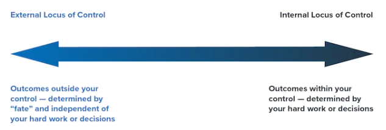

# Module 3 Notes - Habits of Mind

# General Notes

The habits of mind:

- Growth Mindset
- Grit Mindset
- Self-Efficacy & Self Advocacy
- Strengths
- Purpose and Meaning
- Resiliency

We need to have a calm body in order to have access to the higher parts of our
brain that are "in charge" of things like reflective, critical, and logical
thinking.

To be able to fully engage in **mental flexibility** _(the ability to
intentionally choose what we focus on and how we choose to view a situation)_
and exert control over our emotions and behaviors in a positive way, we have to
first calm our nervous system. This is called **bottom-up self-regulation**.

## Articles

- [Locus of Control](https://www.mindtools.com/pages/article/newCDV_90.htm)
- [Positive Psychology in a Pandemic (Pages 9 - 10)](https://drive.google.com/file/d/1oNYuko28AL7c8mSZH_a2K9AM6SyuVWAS/view)

# Growth vs Fixed Mindset

> _“Love challenges, be intrigued by mistakes, enjoy effort and keep on
> learning.”_ ~Carol Dweck, author of _Mindset_

- A **growth mindset** is an indicator of success and well-being where
  challenges are embraced and failure is appreciated as a learning opportunity.
- A **fixed mindset** often leads to stagnation, fear of failure, and avoidance
  of new opportunities.

| Developing a Growth Mindset           | Perpetuating a Fixed Mindset         |
|---------------------------------------|--------------------------------------|
| I value effort and perseverance       | I value talent/intelligence          |
| I learn from failure                  | I avoid failure                      |
| I embrace challenges                  | I avoid challenges                   |
| I welcome feedback                    | I take feedback personally           |
| I find inspiration in others’ success | I feel threatened by others’ success |
| I can’t do that…yet!                  | I can’t do that.                     |

## YouTube Videos On The Subject

- [Growth vs Fixed Mindset](https://www.youtube.com/watch?v=M1CHPnZfFmU)
- [The Power of Believing That You Can Improve - Carol Dweck](https://embed.ted.com/talks/lang/en/carol_dweck_the_power_of_believing_that_you_can_improve)

It's important to focus on _"Not Yet"_ instead of _"Now"_.

# Grit Mindset

> _"'I have a feeling tomorrow will be better' is different from 'I resolve for
> tomorrow to be better.'"_ ~ Angela Duckworth, author of _Grit: the Power of
> Passion and Perseverance_

- [Grit Test](https://angeladuckworth.com/grit-scale/)

Grit, which is defined through the research of Dr. Angela Duckworth as passion
plus perseverance, has been shown to be a predictive factor in achievement of
difficult goals, including academic achievement.

- Essential to grit is persistence, both persistent effort and persistent
  interests across time, demonstrated as sustained passionate commitment to a
  goal.
- Growth mindset, believing our talents can be developed through effort,
  contributes to working harder and achieving more than those with a fixed
  mindset.

[Grit: The Power of Passion and Perseverance - Angela Lee Duckworth](https://embed.ted.com/talks/lang/en/angela_lee_duckworth_grit_the_power_of_passion_and_perseverance)

# Self Efficacy and Self-Advocacy

**Self-efficacy** is a person’s belief in their ability to succeed in a
particular
situation.

**Self-advocacy** is a person's ability to speak up for themselves and the
things
that are important to them.

- Self-advocates can ask for what they need/want and tell people about their
  thoughts and feelings.

## Locus of Control

The orientation of choosing to attribute success and failure to things you have
control over, or to forces outside your influence is known as your **locus of
control**.

- Studies date back to 1960's, with Julian Rotter's investigation into how
  people's behaviors and attitudes affected the outcomes of their lives.
- You have an **Internal Locus of Control** when you believe that you are
  responsible for your successes and failures
- You have an **External Locus of Control** when you believe that you are
  **not** responsible for your successes and failures

An external locus of control is referred to as the **Victim Mindset**, while an
internal locus of control is referred to as the **Resilient Mindset**.

### Key Points

- Your locus of control says a lot about how you view the world and your role in
  determining the course of your life.
- When you believe you have the power to control your own destiny and determine
  your own direction, you have a strong internal locus of control. In most
  cases, this is an important attitude to have if you want to be successful.
- People with an internal locus of control tend to work harder and persevere
  longer in order to get what they want. This is not to say that having an
  external locus of control is always bad: there are some situations where this
  approach can work well. The key for your own personal development is to
  understanding your natural tendency and then adapting it to the situations you
  are faced with.

## Hope

Hope can be defined as our belief in our own capacity to envision clear goals,
plan a path (or paths) to reach those, and have the energy and mindset to make
those goals possible.

Hope is the only positive emotion or way of thinking that requires uncertain or
negative circumstances to activate it.

Hope theory states that momentum toward positive change is created through the
cycle of **Will Power** and **Way Power**, both future-facing and
action-oriented.

## Optimism

Being optimistic implies a belief in our own ability to face and solve problems
and adversities, and contributes to resiliency, the ability to bounce back and
recover quickly from challenges.

We can develop optimism by paying attention to our explanatory style, or the way
we explain events to ourselves, and intentionally examining what we control and
what we don’t.

The story we tell ourselves impacts our thoughts, feelings, and behaviors:

| Optimistic                                                                                     | Pessimistic                                                                             |
|------------------------------------------------------------------------------------------------|-----------------------------------------------------------------------------------------|
| - You have a Growth Mindset - _(e.g. I have lots to learn, I’m going to ask for help)_     | - You have a Fixed Mindset - _(e.g. I’m terrible at math, I give up)_               |
| - You view the impact as Temporary - _(e.g. I’ll do better next time)_                     | - You view the impact as Permanent - _(e.g. I’ll never learn this)_                 |
| - You view the impact as Specific - _(e.g. I’m doing well in English, I know I can do it)_ | - You view the impact as Pervasive - _(e.g. I don’t belong in college)_             |
| - You view the event as Controllable - _(e.g. If I put the effort in, it will pay off)_    | - You view the event as Uncontrollable - _(e.g. There’s nothing I can do about it)_ |

### Hope Theory

[Hope Theory - Make Your Life Better](https://www.youtube.com/watch?v=ZuHZhi1B4T4)

<u>Using Hope Theory:</u>

1. What is a **Goal** that you want to work on?
    1. Make sure your goal is:
        - [x] Specific
        - [x] Measurable
        - [x] Set a Deadline
    2. Write your goal down
    3. How would you feel if you achieved this goal? Make sure it's something
       you care about.
2. Develop a Pathway
    1. Write a pathway down
        - [x] Goal 1
        - [x] Goal 2
        - [x] Goal 3
    2. Develop a variety of pathways (multiple ways)
    3. Create several plans
        - [x] Plan A
        - [x] Plan B
        - [x] Plan C
        - [x] Plan D
3. Anticipate Obstacles
    - Visualize obstacles - **Mental Contrasting with Implementation Intentions
      **
4. What is one action you can take?
    - Use the **IF <negative condition such as _"feel my motivation is low"_>
      THEN I WILL <action to take>** method.

If you feel yourself losing passion or it seems like you exhausted all pathways,
consider alternative goals.

- Use this process repetitively to reach the next goal.

[Optimistic Explanatory Style in Action](https://www.youtube.com/watch?v=KdFqTplNL_o)

- When negative events occur in your life, put things in perspective with the
  three **P**'s.:
    1. It's not **P**ersonal
    2. It's not **P**ermanent
    3. It's not **P**ervasive

# Strengths

> _"Character strengths are the psychological air that we breathe."_ ~ Ryan 
> Niemiec, Education Director, VIA Institute

Research has shown that people who have the opportunity to use and leverage
their top strengths daily experience more positive emotions and higher life
satisfaction, and suffer less stress and depression.

To identify your strengths: [VIA Character Survey](https://viacharacter.org/account/register)

## Sciencer of Character

[The Science of Character](https://www.youtube.com/watch?v=U3nT2KDAGOc)

# Purpose & Meaning

> _“He who has a why to live can bear almost any how.”_ ~  Friedrich Nietzsche  
> _“You often feel tired, not because you've done too much, but because you've 
> done too little of what sparks a light in you.”_ ~ Alexander Den Heijer

**Purpose:** The reason for which something is done or created or for which
something exists

Meaningful work helps people feel a part of something larger than themselves.
When people see their work as meaningful, they are motivated by the tasks they
need to do and feel inspired to do their best possible work.

There are a lot of factors you will consider as you make decisions about your
future career, and one of those factors should be whether or not this career
will allow you to:

- Use your unique strengths and characteristics regularly
- Feel energized and excited to get out of bed most mornings
- Make a difference in the world in a way that matters to you

## YouTube Videos On Purpose

- [What if Your Purpose in Life?](https://www.youtube.com/watch?v=mK66az43EOI)
- [#IWAKEUPFOR | The Ikigai Concept](https://www.youtube.com/watch?v=_X7LQZXllUk&t=8s)
- [Know Your Why | Michael Jr.](https://www.youtube.com/watch?v=1ytFB8TrkTo)

# Resiliency

> _"The human capacity for burden is like bamboo- far more flexible than you'd 
> ever believe at first glance."_ ~ Jodi Picoult 

Psychologists define resilience as the process of adapting well in the face of
adversity, trauma, tragedy, threats, or significant sources of stress.

- Resilience skills can be learned and strengthened. 
- [What is Resilience? With Dr. Rick Hanson](https://www.youtube.com/watch?v=oPvTb9MQhpM)
- [8 Things Resilient People Do](https://www.youtube.com/watch?v=RJKbr8VvvbY)

## Components of Resiliency

According to the **PERT (Psychological and Emotional Resiliency Training)**
Model of Resiliency created by Dr. Thomas Aubrey, there are SIX CORE COMPONENTS
of resiliency:

- Inner Balance with Self-regulation
- Mental flexibility
- Purpose and Meaning
- Positive psychological strengths
- Healthy and Meaningful Relationships
- Self-care & revitalization

Each of these components can be developed and strengthened in your own life in
order to help you be more resilient.

# Summary

Summary
The key to strengthening the Habits of Mind that support success is: Practice,
Practice, Practice!

Just learning about these concepts isn't enough - you have to apply them to your
life and practice them regularly. Knowledge is only potential power. Take what
you have learned about the Habits of Mind in this module, and practice using
these skills as you move through the rest of this class, and the rest of your
academic experience.