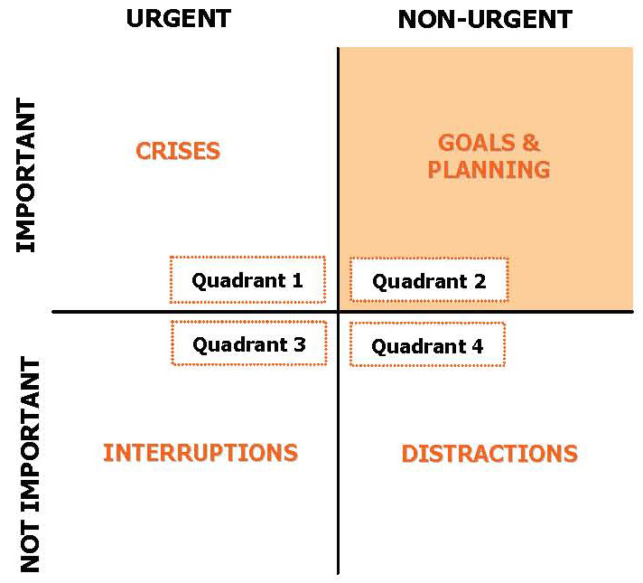

# Module 4 - Success Strategies

- [What's Metacognition and Why Does it Matter?](https://www.youtube.com/watch?v=QJWsIJQHUxM)
- [Self-Reflection for Metacognition](https://www.virtuallibrary.info/self-reflection-for-metacognition.html)
- [Creating a Good Study Plan](https://www.youtube.com/watch?v=qRE0WicGz4I)

# Module 4.1 Metacognition and Success Strategies

## What is Metacognition?

- Metacognition is the practice of being aware of one’s own thinking.
- Some scholars refer to it as “thinking about thinking.”

An example of metacognition is the momentary awareness of knowing what you know
or do not know (such as realizing that you're at the end of a page and didn't
actually read it).

- When we notice ourselves having an inner dialogue about our thinking and it
  prompts us to evaluate our learning or problem-solving processes, we are
  experiencing metacognition at work.
- This skill helps us:
    - Think better
    - Make sound decisions
    - Solve problems more effectively.

[Research](https://www.sciencedirect.com/science/article/pii/S1053810013000068)
by Weil et al.(2013) suggests that: as a young person's metacognitive abilities
increase, they achieve at higher levels.

Fogarty and Pete outline three aspects of metacognition:

1. **Planning**
2. **Monitoring**
3. **Evaluation**

Metacognitive skills provided a basis for broader
psychological [self-awareness](https://www.rootsofaction.com/self-awareness-meaning-purpose/).

### Metacognitive Strategies

#### Planning Strategies

Planning strategies used to strengthen metacognition help students scrutinize
plans at a time when they can most easily be changed.

- **"Inking Your Thinking"** is a planning strategy that requires students to
  reflect on a lesson they are about to begin.
    - Examples:
        - _"I predict..."_
        - _"A question I have is..."_
        - _"A picture I have of this is..."_

#### Monitoring Strategies

Monitoring strategies used to strengthen metacognition help students check their
progress and review their thinking at various stages.

- Monitoring strategies encourage recovery of learning.
- We can recover out [memory](https://www.psychologytoday.com/us/basics/memory)
  by scanning or re-reading
- **"Alarm Clock"** is a monitoring strategy that is used to recover or rethink
  an idea once the student realizes something is amiss.
    - The idea is to develop internal signals that sound an alarm. This signal
      prompts the student to recover a thought, rework a math problem, or
      capture
      an idea in a chart or picture.

Metacognitive reflection involves thinking about “What I did,” then reviewing
the pluses and minuses of one’s action.

Finally, it means asking, “What other thoughts do I have” moving forward?

#### Evaluation Strategies

**"Connecting Elephants"** is an evaluation strategy that helps students
self-evaluate and apply their learning.

- In this exercise, the metaphor of three imaginary elephants is used. The
  elephants are walking together in a circle, connected by the trunk and tail of
  another elephant. The three elephants represent three vital questions:
    1. What is the big idea?
    2. How does this connect to other big ideas?
    3. How can I use this big idea?
- Using the image of a “big idea” helps students magnify and
  synthesize their learning. It encourages them to think about big ways their
  learning can be applied to new situations.

### Metacognition and Self-Reflection

- Reflective thinking is at the heart of metacognition.
- John Dewey, a renowned psychologist and education reformer, claimed that
  experiences alone were not enough. What is critical is an ability to perceive
  and then weave meaning from the threads of our experiences.
- The function of metacognition and self-reflection is to make meaning. The
  creation of meaning is at the heart of what it means to be human.

## Critical Thinking

Critical thinking requires you to use logic and reasoning to evaluate evidence
or information to make a decision or reach a conclusion.

- The ability to look at things from a new perspective.

Critical thinking is:

- A foundation for effective communication
- The principal skill used in effective decision making
    - Sort out conflicting claims
    - Weight the evidence for and against viewpoints
- At the core of creating new knowledge
    - Willing to change views
- A way to uncover and/or let go of bias and prejudices

### Critical Thinking Process

The critical thinking process is really nothing more than asking the right
questions to understand a problem or issue and then gathering the data you need
to complete the decision or take sides on an issue.

1. **Where does the issue lie or what is the problem or issue I am considering
   really about?**
2. **What are my options?**
    - Remember also that sometimes the best option might be a combination of the
      options you identify initially.
3. **What do I know about each option?**
4. **How good is my information?**

#### Fallacies and How to Avoid Them

Fallacies are defects in logic that weaken arguments. Learn to identify them in
your own thinking so you can strengthen your positions, as well as in the
arguments of others when evaluating their strength.

| Fallacies              | Description                                                                                                                                                                               | Examples                                                                                                                                                                                                                        | How to Avoid It in Your Own Thinking                                                                                                                                                                                                                                                                                                                                                                     |
|------------------------|-------------------------------------------------------------------------------------------------------------------------------------------------------------------------------------------|---------------------------------------------------------------------------------------------------------------------------------------------------------------------------------------------------------------------------------|----------------------------------------------------------------------------------------------------------------------------------------------------------------------------------------------------------------------------------------------------------------------------------------------------------------------------------------------------------------------------------------------------------|
| Generalizations        | Making assumptions about a whole group of people based on an inadequate sample.                                                                                                           | Engineering students are nerds.  My economics class is boring, and my friend says her economic class is boring, too—therefore all economics classes are boring.                                                         | What kind of sample are you using? Is it large enough to support the conclusions? You may want to increase your sample size or draw a more modest conclusion by using the word “some” or “many.”                                                                                                                                                                                                         |
| False Cause            | Drawing improper conclusions through sequencing. If A comes before B, then A causes B.                                                                                                    | I studied biology last term, and this term I’m taking organic chem, which is very confusing. Biology makes chemistry confusing.                                                                                                 | When making causal statements, be sure you can explain the process through which A causes B beyond their mere sequence.                                                                                                                                                                                                                                                                                  |
| Personalizations       | Also known by their Latin names (ad hominem, or “against the man,” and tu quoque, or “you too”). Inserting personalities inappropriately into an argument. Common in political arguments. | Against the man: I won’t support Senator Smith’s education bill. He’s had a mistress and marital problems.                                                                                                                      | Focus on the merits and supporting data of an argument, not on the personality or behavior of the people making the arguments.                                                                                                                                                                                                                                                                           |
| Everyone Does It       | Also known by its Latin name (ad populum, or “against many”). Justifying an issue based solely on the number of people involved.                                                          | You too: A parent explains the evidence of the risks of binge drinking. The child rejects the arguments, saying, “When you were my age, you drank too.”  It’s healthy to drink only soda; millions of American kids do. | The popular position is not always the right one. Be wary of arguments that rely exclusively on one set of numbers.                                                                                                                                                                                                                                                                                      |
| Appealing to Authority | Using an endorsement from someone as a primary reason for supporting a point of view.                                                                                                     | We should oppose higher taxes; Curt Schilling does.  Pitcher Curt Schilling may be a credible authority on baseball, but is he an authority on taxes?                                                                   | Quoting authorities is a valuable tool to build an argument; make sure the authorities you quote are truly subject matter experts on the issue you are discussing.                                                                                                                                                                                                                                       |
| Weak Analogy           | Using irrelevant similarities in two objects to draw a conclusion.                                                                                                                        | Cars and motorcycles are both driven at high speeds on the highway. Car drivers aren’t required to wear helmets, so motorcycle riders shouldn’t have to either.                                                                 | You can draw an analogy between just about any two objects or ideas. If you are using an analogy, make sure you identify the properties relevant to the argument you are making and see if both share those properties. (In the example, the motorcycle does not provide protection to the rider, but the car does. Equating the two vehicles based on traveling speed is not relevant to the argument.) |
| False Dichotomy        | Setting up a situation in which it looks like there are only two possible options. If one option is discredited, the other must be accepted.                                              | The classic example here is “America, love it or leave it.”                                                                                                                                                                     | Examine your own thinking. Are there really only two options? Look for the third option. If you were asked to develop a compromise between the two positions, what would it look like? What would its strengths and weaknesses be?                                                                                                                                                                       |

### Tips for Critical Thinking

- Beware of your mind-set.
- Be willing to say, “I don’t know.” Ask questions or do some focus research to
  get what you still need
- Consider all points of view; seriously consider more than two (look for grey
  areas).
    - Make sure your assumptions and points of view are supported by facts, not
      opinions.
- Keep an open mind.
    - Answer three questions about your supporting data:
        1. Is it enough support?
        2. Is it the right support?
        3. Is it credible?
- Understand different points of view.
- Understand before criticizing.
- Emotions get in the way of clear thinking.
- Examine the source.
- Learn what types of fallacies you use habitually, and then be on the lookout
  for them. Writers will often rely on certain types of arguments as a matter of
  habit. Review some of your old papers to identify which fallacies you need to
  avoid.
- Be careful of broad generalizations. Claims that use absolute words like
  "all," "none," "always," "never," "on one," and "everyone" require much more
  proof than claims using words like "most," "some," "often," "rarely," "
  sometimes," and so on.

### Critical Thinking Over The Internet

* Beware of appearances.
* What is the source?
    * Is the author well respected in the field?
* Why was the information posted?
    * Does the author or publisher have an agenda for publishing the
      information? How does that agenda affect the credibility of the
      information?
* What is the date of the Website?
    * When was this information developed? Is that important? Why?
* Can the information be verified elsewhere?

## Creative Thinking

Creative thinking is the ability to look at things from a new perspective, to
come up with fresh solutions to problems.

- It is a deliberate process that allows you to think in ways that improve the
  likelihood of generating new ideas or thoughts.

Creative Thinking is part of the Critical Thinking process. Use it for:

* Generating alternatives
* Thinking of possibilities
* Creative problem solving
* Creating new ideas
* Using more of your potential

<u>Myths about creative thinking:</u>

- **Creativity is an inherited skill**
- **Creativity is free-form thinking**

### Tips for Creative Thinking

- **Feed your curiosity**
    - Creativity is often as much about rearranging known ideas as it is about
      creating a completely new concept.
- **Develop your flexibility** by looking for a second right answer.
- **Combine old ideas in new ways**
- **Think metaphorically**
- **Ask**

The value of an idea can only be determined by comparing it with another.
Multiple ideas will also help you generate new approaches by combining elements
from a variety of “right” answers.

- The greatest danger to creative thinking is to have only one idea. Always ask
  yourself, “What’s the other right answer?”

### Summary

* Consider the source
* Seek out alternative views
* Ask questions
    * Who
    * What
    * When
    * Where
    * Why
    * How

# Module 4.2 - Decision-Making

## Reasoning and Decision-Making

- Much of cognition-related research has focused on the broad areas of reasoning
  and
  [decision-making](https://www.psychologytoday.com/us/basics/decision-making)
- Noted by psychologists Danieel Kahneman and Amos Tversky:
    - Fast thinking is intuitive, automatic, and nearly impossible to switch
      off.
        - Relies on heuristic processes to come to a _good enough_ decision.
    - Slow thinking takes a great deal of time and energy analyzing all
      available
      data before reaching a conclusion.
    - He has a book: **Thinking, Fast and Slow (2011)**

Culture also affects how one thinks:
<https://www.psychologytoday.com/us/blog/non-weird-science/202105/do-we-wear-different-thinking-caps>

- People in Western culture focus on the attributes of individual objects or
  ideas and consider parts of a problem separately from the whole.
- People in Eastern culture are more likely to focus on the broader context
  and the relationships between objects or ideas.

### List of Biases

| Bias                                                                                                                                        | Short Description                                                                                  |
|:--------------------------------------------------------------------------------------------------------------------------------------------|:---------------------------------------------------------------------------------------------------|
| [The Dunning-Kruger Effect](https://www.psychologytoday.com/us/basics/dunning-kruger-effect)                                                | The less you know, thee more you think you know.                                                   |
| [Confirmation Bias](https://www.psychologytoday.com/us/blog/science-choice/201504/what-is-confirmation-bias)                                | Following only the eevidence that confirms your own beliefs.                                       |
| [Self-serving Bias](https://www.psychologytoday.com/us/blog/in-practice/201301/the-self-serving-bias-definition-research-and-antidotes)     | Blame your failures on someone else.                                                               |
| [Overconfidence Bias](https://www.psychologytoday.com/us/blog/inside-the-box/201509/creativity-breeds-overconfidence)                       | Using only one source                                                                              |
| [Groupthink](https://www.psychologytoday.com/us/basics/groupthink)                                                                          | Adopting the opinions of a group                                                                   |
| [The Status Quo](https://www.psychologytoday.com/us/blog/persuasion-bias-and-choice/202006/status-quo-bias-why-things-feel-stuck-sometimes) | Resistance to change.                                                                              |
| [Anchoring Bias](https://www.psychologytoday.com/us/blog/stretching-theory/201902/outsmart-the-anchoring-bias-in-three-simple-steps)        | Giving undue weight to the first piece of info received, even if it's incorrect or incomplete. |

## Decision-Making

- Decisions can be complicated by external and internal factors and are often
  more difficult to make when the outcomes are relatively similar.

[How to Make Better Decisions | 3 Quick Tips](https://www.youtube.com/watch?v=_0onFbc5FQM)

### 5 Tips for Better Decision-Making

1. Rest or sleep on it
2. Take your time
3. Gather the facts
    - Four steps to effective
      problem-solving ([College Success Chapter 3.4](https://open.lib.umn.edu/collegesuccess/chapter/3-4-problem-solving-and-decision-making/))
        1. Define the problem
        2. Narrow the problem
        3. Generate solutions
        4. Choose the solution
4. Stay open to all possibilities
5. Create rules

# Module 4.3 - Goal Setting

[Chapter 14: Time Management Theory](https://open.maricopa.edu/blueprint2/chapter/14-time-management-theory/)
from _Blueprint for Success in College and Career_.

- Scroll to "How to Start Reaching Your Goals"

There are long-term and short-term goals:

- **Long-term** goals usually take 3 - 5 years
- **Short-term** goals usually take 1 - 2 years
- **Mini** goals usually take 2 -3 months
- **Micro** goals are daily goals

## Purpose and Goal Setting

> _"Obstacles are things a person sees when he takes his eyes off his goal.”_  
> --E. Joseph Cossman

- Choosing a meaningful purpose gives your life a direction and creates inner
  motivation.

Focus on creating **SMART** goals:

- **S**pecific
- **M**easurable
- **A**ttainable
- **R**ealistic
- **T**imely

[How to Set SMART Goals | Goal Setting for Students](https://www.youtube.com/watch?v=i0QfCZjASX8)

Accountability is another important factor and is easier to determine with
short-term goals asking:

- _How many of the things that you set out to accomplish, did you accomplish?_
- _How many were the most important things on that list? Were you satisfied?_
- _Were you successful? Did you learn anything for future planning or time
  management?_
- _Would you do anything differently?_

### Personal Goals

Below is a set of questions that will help focus on personal goals:

1. What are my top-priority goals?
2. Which of my skills and interests make my goals realistic for me?
3. What makes my goals believable and possible?
4. Are my goals measurable? How long will it take me to reach them? How will I
   know if I have achieved them?
5. Are my goals flexible? What will I do if I experience a setback?
6. Are my goal controllable? Can I achieve them on my own?
7. Are my goals in sync with my values?

# Module 4.4 - Time Management

- [Chapter 14: Time Management
  Theory](https://open.maricopa.edu/blueprint2/chapter/14-time-management-theory/)
  from _Blueprint for Success in College and Career_
- [Randy Pausch Lecture: Time Management](https://open.maricopa.edu/blueprint2/chapter/14-time-management-theory/)
- A good rule of thumb for college classes is to study for 2-3 hours outside of
  class per 1-hour spent in class.
- [POMODORO TECHNIQUE](https://www.youtube.com/watch?v=mNBmG24djoY)
- [How To Make An Effective Study Timetable | Study Effectively](https://www.youtube.com/watch?v=687p04jRDd4)

> _"If you had a bank that credited your account each morning with $86,400, but
> carried no balance from day to day and allowed you to keep no cash in your
> account, and every evening cancelled whatever part of the amount you had
> failed to use during the day, what would you do? Draw out every cent, of
> course! Well, you have such a bank, and its name is time. Every morning it
> credits you with 86,400 seconds. Every night it writes off as lost whatever
> of these you have failed to invest to good purpose. It carries no balance;
> it allows no overdrafts. Each day it opens a new account with you. Each night
> it burns the record of the day. If you fail to use the day’s deposit, the
> loss is yours. There is no going back. There is no drawing against the morrow.
> You must live in the present – on today’s deposit. Invest it so as to get the
> utmost in health and happiness and success."_  
> – Anonymous

# Module 4.5 - Procrastination and Productivity

- [Procrastination (Tales of Mere Existence)](https://www.youtube.com/watch?v=ItMFWpKofSg)
- [Chapter 16: Time Management Reality](https://open.maricopa.edu/blueprint2/chapter/16-time-management-reality/)
  from _Blueprint for Success in College and Career_
- [Tim Urban: Inside The Mind of a Master Procrastinator](https://www.youtube.com/watch?v=arj7oStGLkU)
- [Big Rocks First: Double Your Productivity This Week](https://zenhabits.net/big-rocks-first-double-your-productivity-this-week/)
- [Big Rocks](https://www.youtube.com/watch?v=zV3gMTOEWt8)
- Focus on doing more important tasks first

Reasons we procrastinate:

- I don't feel like it
- Perfectionism
- Fear of success
- Fear of failure

The top five fears that cause us to procrastinate:

1. Fear of failure
2. Fear of success
3. Fear of control
4. Fear of separation
5. Fear of attachment

Goal setting can help to create specific and concrete steps to follow and can
be used to break down large or overwhelming tasks into smaller, more manageable
parts.

Use the following outline to tailor your goals to address procrastination and
allow you to think about the other piece:

1. Goal
    1. Nonspecific
    2. Specific
2. Consequences (of continued procrastination)
    1. External
    2. Internal
3. Style/ Behavior (What are you doing instead of achieving your goal?)
4. Self-talk (What are you saying to yourself when you are procrastinating?)
    1. Negative Messages
    2. Counter with a positive message
5. Inner message/fear (What fears can you identify? Use the list above)
6. Plan of Action (what, when, and how will you take action?)

#### Example Goal Plan

1. **Goal**
    1. **Nonspecific:** Improve dental hygiene.
    2. **Specific:** Make an appointment by this Friday and go to the dentist to get
       my teeth cleaned.
2. **Consequences (of continued procrastination)**
    1. **External**
        1. I will have a cavity in every tooth.
        2. The dentist will ask if I ever brush.
        3. I will have gum disease.
        4. They will have to drill into my teeth for waiting so long.
        5. They will have to pull my teeth.
    2. **Internal**
        1. I won't feel good about myself.
        2. I will feel guilty.
        3. I will feel depressed if I have to wear dentures because I neglected
           my teeth.
3. **Style/ Behavior (What are you doing instead of achieving your goal?)**
    1. I would make a dentist appointment three to four weeks in advance and put
       it completely out of my mind. The day or so after my appointment I would
       ironically remember and call to excuse my memory lapse and make another
       appointment. To my surprise, time flies, and I am as busy as ever and I
       forgot again! This vicious cycle continues and to make matters more
       complicated, they have started charging me for appointments to which I
       don't show up.
4. **Self-talk (What are you saying to yourself when you are procrastinating?)**
    1. **Negative Messages**
        1. I might have lots of cavities.
        2. I will be anxious and nervous.
        3. I will waste valuable time.
        4. It will hurt.
        5. It will be embarrassing because of all the appointments I've missed.
    2. **Counter with a positive message**
        1. I will make an appointment anyway.
        2. I can think of the positive consequences of going to the dentist.
        3. I will tell myself this is something important to do and it's not a
           waste of time.
        4. I remind myself of the old proverb "no pain, no gain."
        5. I can explain my fear to the dentist.
5. **Inner message/fear (What fears can you identify? Use the list above**
    1. The ordinary task of going to the dentist is not so easy and ordinary for
       some people. For me, going to the dentist is one of my biggest fears for
       various reasons. To begin with, I fear the loss of control. Sitting in
       the dentist's chair with this stranger probing down my throat makes me
       feel anxious. Not knowing what he is doing and not being able to control
       where he is drilling or poking a needle contributes to my feelings of
       losing control. The pain that will inevitably occur is fear itself. I do
       anything to avoid pain, and avoiding the dentist will do just that. If I
       did have a cavity, it would lower my self-esteem because I have vowed to
       myself not to get any more cavities, therefore, I fear failure. Lastly, I
       fear letting others down. I usually do not have any cavities and if I did
       my mother would be disappointed in me. Fearing the loss of control, pain,
       failure, and disappointment relates to my procrastinating to make a
       dentist appointment because I fear my self-esteem will be damaged. By
       protecting my self-esteem from going to the dentist, I have blinded
       myself from seeing the consequences of not visiting the dentist. In
       essence, I procrastinate in going to the dentist to protect my
       self-esteem.
6. **Plan of Action (what, when, and how will you take action?)**
    1. I will identify and confront the fears stopping me from doing this simple
       task.
    2. I will realize I am in control, because I will ask the dentist exactly
       what he is going to do and if he changes his plan of action to tell me.
       Knowing exactly what he is doing will give me a feeling of control and I
       will feel at ease.
    3. If my dentist is going to do anything painful, I will ask him to warn me.
       Not being surprised by the pain will make my visit more comfortable.
    4. I will realize I have done all I can to protect myself against cavities
       by brushing and flossing after meals. Realizing I have done everything
       possible to prevent cavities will lessen my fear of failure.
    5. If I do have a cavity, I will remember I have done everything possible to
       prevent them. I will experience less pain in disappointing others.
    6. After coming to terms with my fears, I made a dentist appointment on
       October 27 and marked it on my calendar.

## The Time Management Matrix

## The Big Rocks

The idea is that things you need to get done are either big or little rocks.
Fill your bucket (day) with big rocks first, leaving room for pebbles.

- Also do it early.

# Module 4 Summary

**Success**: staying on course until you reach your desired outcomes and
experiences (Downing, 2017, p. 29-30).

Metacognition is simply thinking about your thinking. When learning, it is
important to take many meta moments (plan, monitor, evaluate, and reflect) to
aid in meaningful connections with your course content. Metacognition will
heighten your self-awareness and allow you to correct thoughts and behaviors
that hinder academic and personal success.

How you make decisions are formed in metacognition, but we have to watch out for
fallacies in reasoning that inhibit critical thinking.

Don't forget to use the 5 tips for decision-making to help navigate the
decision-making process and don't let the pebbles of life hinder the Big Rocks
in your life. Being successful in college isn't all about having a high GPA or
being perfect.

As Mr. Hashim Pipkin mentioned, you want to be mindful of your GPA, but not
stressed about your GPA. Successful students give their best efforts by
attending class ready to learn and engage in class discussions and activities,
ask for help, and manage their time while prioritizing their academic
responsibilities.

Planning out your week or month with a calendar, and reminders will help you
stay on track. Set goals for yourself and build supportive family, peer,
faculty, and staff networks to assist with accountability towards your goals.

Lastly, Don't forget to celebrate your accomplishments and have some fun along
your academic journey.
