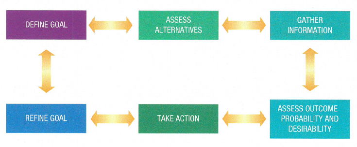

# Module 5 - Career

# General Notes

- [Overview of Career Theory](assets/overview_of_career_theory.pdf)
- [Decision-Making: Chapter 8](assets/decision-making_chapter_8.pdf)
- [Decision-Making Google Slides](https://docs.google.com/presentation/d/e/2PACX-1vRGvm8g34xl1pXBNifGGgqbP-g0bwBjfN1rJBWWDadMkqY4zPRtdUHGETVzlQBloBWC_alIe-Oqmhl6/embed?start=false&loop=false&delayms=3000)
- <www.mynextmove.org>
- <https://mcccd.pipelineaz.com/>
- [MCCCD Pipeline AZ Assessment](https://mcccd.pipelineaz.com/assessment)

# Module 5.2 - Career Decision-Making

## Notes on Chapter 8

- <https://www.cashcourse.org> is a free website designed for college students
  to keep track of their financial literacy.

### Decision-Making Styles

- **Planning**
    - Considering values, objectives, necessary information, alternatives, and
      consequences; a rational approach with a balance between thinking and
      feeling.
- **Impulsive**
    - Little thought or examination; taking the first available alternative.
- **Intuitive**
    - Automatic, preconscious choice based on inner harmony.
- **Compliant**
    - Non-assertive; letting someone else decide; following someone else's plan.
- **Delaying**
    - Procrastination, avoidance, hoping someone or something will happen to
      avoid making a decision, postponing thought and action.
- **Fatalistic**
    - What will be; letting the environment decide; leaving it up to
      fate.
- **Agonizing**
    - Worrying that a decision will be the wrong one; getting lost in all the
      data; overwhelmed by analyzing alternatives.
- **Paralytic**
    - Complete indecision and fear; accepting responsibility but being unable
      to act on it.
- **Defaulting**
    - Choosing the alternative with the lowest level of risk.

**Planning** and **Intuitive** styles are the most effective.

--- 

When you feel stuck or unable to make a decision, try asking yourself the
following questions:

1. What are my assumptions (attitudes) affecting my decisions
2. What are my feelings regarding these decisions?
3. Why am I clinging behavior that prevents me from making this decision?
4. What further information do I need in order to generate alternatives?

### Conditions For Change

Three things must be present to trigger change:

1. You must be dissatisfied with what is
2. You much have a concept of what would be better
3. You must believe that there is a way to get there

This all works on the premise that the benefits of change outweigh the costs
of making the change.

### A Decision-making Model

The five steps necessary to make an informed and desirable decision are:

1. **Defining your goal**
    - Can you change part of the problem into a definite goal?
    - What do you want to accomplish by what date?
    - Can you state your objective now?
2. **Assessing your alternatives**
    - What are your alternatives or options?
    - Are your alternative choices consistent with your important values?
    - Can you summarize your important values in writing?
    - What is a reasonable amount of time in which to accomplish your
      alternatives?
3. **Gathering information**
    - What do you know about your alternatives?
    - What assumptions are you making that you should check out?
    - What more do you need to know about your alternatives?
    - What sources will help you gather more information about your
      alternatives?
    - What sources will help you discover further alternatives?
4. **Assessing the consequences**
    - Probability:
        - Whatis the probability of the success of each alternative?
        - Are your highest values part of each alternative?
    - Desirability:
        - Can you eliminate the least desirable alternatives first?
        - When you consider the best possible alternative, how much do you want
          it?
        - What are you willing to give up in order to get what you want?
5. **Establishing your plan of action or the steps needed to achieve your goal.
   **
    - Weighing everything you now know about your decision, what is your plan of
      action?
    - What dates will you start and complete your plan of action?
    - Does your plan of action state a clear objective?
    - Does your plan of action specify the steps necessary to achieve its
      objective?
    - Does your plan of action specify the conditions necessary to achieve its
      objective?

### Setting Goals and Objectives

- **Goals**
    - Broad statements of purpose.
    - They target the desired outcome, are specific, and are long rage or short
      term.
    - Goals refer to an ongoing process.
- **Objectives**
    - Specific and practical steps used to accomplish goals.
    - Short-term, bite-sized steps.
    - Visible and measurable signposts that indicate where you are in relation
      to reaching a goal.

<u>Remember these four points when setting goals and objectives:</u>

- Consider what you are wiling to give up to get what you want.
- Give yourself a realistic timeline.
- Set your goals high.
- Reward yourself after completing each object and after reaching each goal.

### Stress Management Techniques

- Take time for yourself
- Maintain or start a realistic exercise schedule
- Socialize with friends and family
- Remind yourself ab out personal strengths
- Practice gratitude
- Encourage a sense of humor
- Keep your eye on the goal

### Websites To Help With College Choicee

- [College Insight](https://college-insight.org/)
    - Highlights data on schools' affordability, diversity, and student success.
    - Can compare dat aon up to four sources at the college, state, or national
      levels.
- [College Measures](https://www.air.org/project/college-measures)
    - This site draws from multiple data sources to show schools` performances
      in areas such as student success, school efficiency and productivity, and
      graduates pay and debt.
- [College Navigator](https://nces.ed.gov/collegenavigator/)
    - Data primarily from the National Center for EEducation Statistics, which
      builds and compares lists of schools; also has an interactive map.
- [College Results Online](https://collegeresults.org/)
    - A web tool from the Education Trust that provides information about
      college graduation rates.
    - The site lets users compare colleges by many criteria, including
      graduation rates, financial aid, student cost, and freshman admission
      data.

# Module 5.3 - Career Planning

- It's important to not select a career based off a limited perspective, such
  as a career portrayed in the media, and to instead select one based off
  research, hands-on experience, and the perspectives of people who have
  worked in the field.

# Module 5.4 Career Assessment

- [MCCCD Pipeline AZ Assessment](https://mcccd.pipelineaz.com/assessment)
- [Pipeline AZ Quickstart Guide PDF](assets/pipline_az_quickstart_guide.pdf)
- [Via Character Strengths Assessment](https://www.viacharacter.org/account/register)
- [Via Character Strengths PDF](assets/via_character_strengths.pdf)
- [Google Slides Presentation](https://docs.google.com/presentation/d/e/2PACX-1vQktif_j5CHex8LNXKrKufeKDGMFtjkjfCEhSmmzWouyI0X90u5HnR-RrRlBuSC7S3cGesM4DNDCT29/embed?start=false&loop=false&delayms=10000)
- [MCCCD and Pipeline AZ Youtube Video](https://www.youtube.com/watch?v=eiRXApox7YA)

# Module 5 Summary

One of the most difficult things a college student can do is choose a major or
degree and career pathway. Career exploration is a continual process that you
will engage in repeatedly throughout your life. Engaging in self-exploration,
career research, work-based experiences, and completing your educational
planning will set you on a pathway for success.