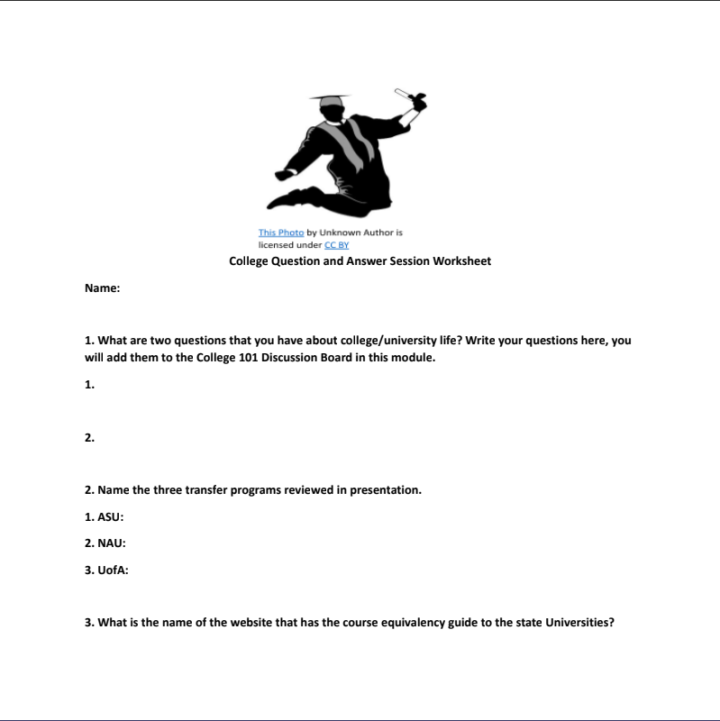
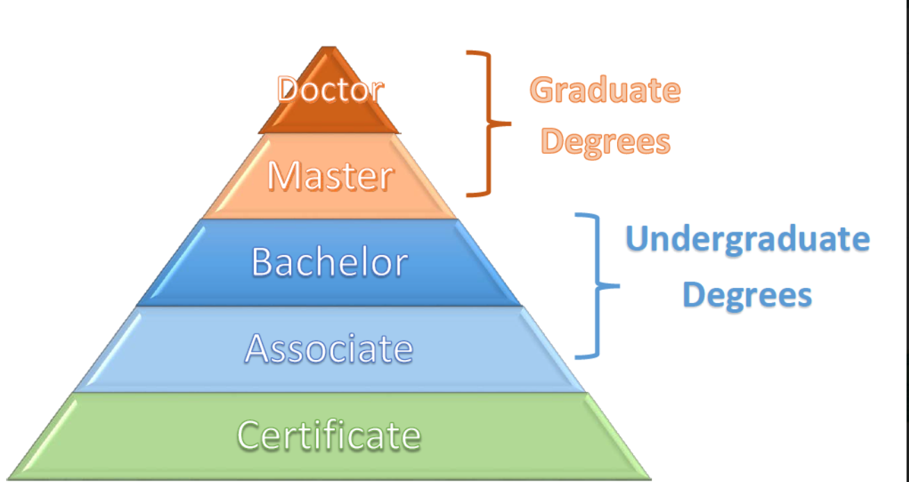
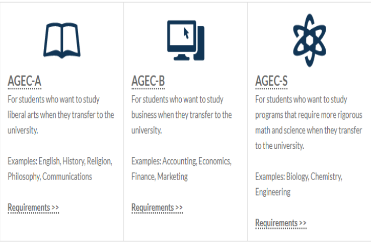
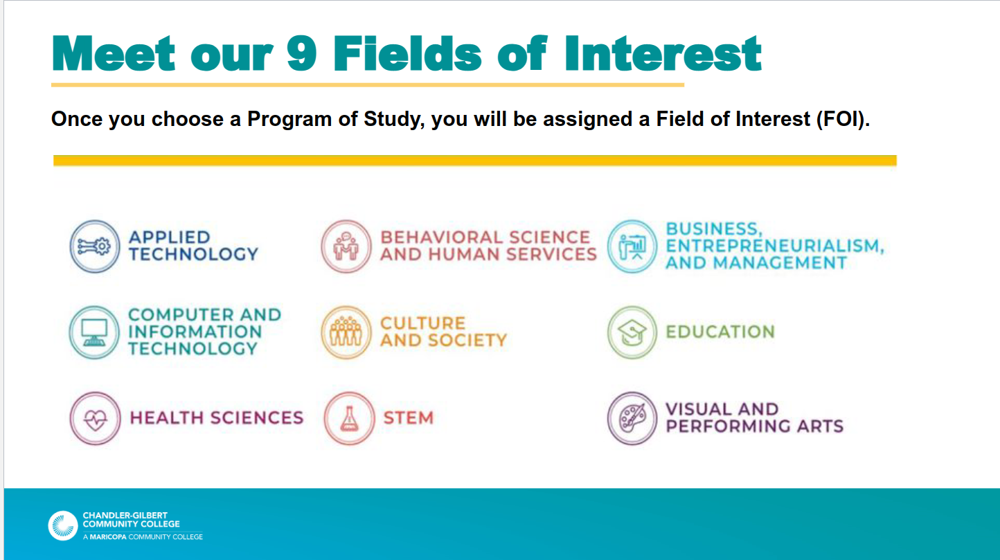

# Module 6 - Education Planning

<!-- TOC -->
* [Module 6 - Education Planning](#module-6---education-planning)
* [General Notes](#general-notes)
  * [Readings](#readings)
* [Module 6.1 - College 101](#module-61---college-101)
  * [2.4 - Goal Setting](#24---goal-setting)
    * [Questions to Consider](#questions-to-consider)
    * [Values](#values)
    * [Long-Term Goals](#long-term-goals)
    * [Short-Term Goals](#short-term-goals)
    * [Setting Long and Short-term Goals](#setting-long-and-short-term-goals)
    * [Planning for Adjustments](#planning-for-adjustments)
  * [4.2 - Planning Your Degree Path](#42---planning-your-degree-path)
    * [Questions To Consider](#questions-to-consider-1)
    * [Types of Degrees](#types-of-degrees)
      * [Self-Assessments For Choosing Careers](#self-assessments-for-choosing-careers)
    * [Associate's Degree](#associates-degree)
    * [Bachelor's Degree](#bachelors-degree)
      * [General Education](#general-education)
      * [Major Courses](#major-courses)
      * [Electives](#electives)
    * [Graduate Degrees](#graduate-degrees)
    * [Other Post-Baccalaureate Credentials](#other-post-baccalaureate-credentials)
    * [Majors and Minors](#majors-and-minors)
    * [Preprofessional Programs](#preprofessional-programs)
    * [Special Requirements of Majors](#special-requirements-of-majors)
      * [Fieldwork and Internships](#fieldwork-and-internships)
      * [Clinicals](#clinicals)
      * [Student Teaching](#student-teaching)
      * [Service Learning](#service-learning)
  * [4.3 - Making a Plan](#43---making-a-plan)
    * [Questions to Consider:](#questions-to-consider-)
    * [Curriculum Maps](#curriculum-maps)
    * [Academic Advisors](#academic-advisors)
    * [Common Functions of Academic Advisors](#common-functions-of-academic-advisors)
    * [Interactive Planning Technology](#interactive-planning-technology)
    * [Academic Planning Readiness Checklist](#academic-planning-readiness-checklist)
    * [Planning for After Graduation](#planning-for-after-graduation)
  * [4.4 - Managing Change and the Unexpected](#44---managing-change-and-the-unexpected)
    * [Questions to Consider](#questions-to-consider-2)
    * [Expecting Change](#expecting-change)
    * [Managing Change](#managing-change)
    * [Asking for Help](#asking-for-help)
    * [Mentors](#mentors)
* [Module 6.2 - College Q & A](#module-62---college-q--a)
  * [Transferring](#transferring)
  * [Education Degrees](#education-degrees)
  * [What is a Certificate](#what-is-a-certificate)
  * [AGEC: Arizona General Education Curriculum](#agec--arizona-general-education-curriculum)
  * [General Education Designations](#general-education-designations)
  * [What is an Associate Degree](#what-is-an-associate-degree)
  * [What is a Bachelor's Degree](#what-is-a-bachelors-degree)
    * [B.S.](#bs)
    * [B.A.](#ba)
  * [Graduate Degrees](#graduate-degrees-1)
    * [Masters](#masters)
    * [Ph.D. and MD](#phd-and-md)
* [Module 6.3 - Fields of Interest](#module-63---fields-of-interest)
* [Module 6 Summary](#module-6-summary)
  * [References](#references)
* [Academic Advisor Documents](#academic-advisor-documents)
<!-- TOC -->

# General Notes

## Readings

- [2.4 Goal Setting](https://open.maricopa.edu/strategiesforfirstyearcollegesuccess/chapter/goal-setting/)
- [4.2 Planning Your Degree Path](https://openstax.org/books/college-success/pages/4-2-planning-your-degree-path)
- [4.3 Making a Plan](https://openstax.org/books/college-success/pages/4-3-making-a-plan)
- [4.4 Managing Change and the Unexpected](https://openstax.org/books/college-success/pages/4-4-managing-change-and-the-unexpected)

# Module 6.1 - College 101

## 2.4 - Goal Setting

> _“In every single thing you do, you are choosing a direction. Your life is a
product of choices.”_
> -Dr. Kathleen Hall, CEO of the Stress Institute and Mindful Living Network

### Questions to Consider

- What beliefs help shape your decision-making and goals?
- How do you set manageable goals that will help you stay on track?

### Values

- Values are the basic beliefs that guide our thinking and actions.
    - Values influence both our attitudes and our actions.
- Knowing what you value and making plans accordingly is an important effort to
  help you stay on track toward your goals.

### Long-Term Goals

- Future goals that often take years to complete.
    - _Bachelors_
    - _Purchasing a home_
    - _Running a marathon_
- Long-term goals should be aligned with your values.

### Short-Term Goals

- It's easier to stay focused, and you'll become less overwhelmed in the process
  of completing short-term goals.

### Setting Long and Short-term Goals

Long-term and short-term goals are not bound by a time difference.

- Short-term goals are the action steps that take less time to complete than
  a long-term goal, but help you work towards your long-term goals.

### Planning for Adjustments

1. Am I meeting my short-term goals as planned?
    - If so, celebrate!
    - If not, you may want to additionally consider:
2. Are my short-term goals still planned across time in a way where they will
   meet my long-term goals?
    - If so, continue on your path.
    - If not, reconsider the steps you need to take to meet your long-term goal.
        - If you’ve gotten off track or if you’ve learned that other steps must
          be taken, set new short-term goals with timelines appropriate to each
          step.
        - You may also want to seek some additional advice from others who have
          successfully met long-term goals that are similar to your own.
3. Are my long-term goals still relevant, or have my values changed since I set
   my goals?
    - If your goals are still relevant to your interests and values, then
      continue on your path, seeking advice and support as needed to stay on
      track.
    - If your goals are no longer relevant or aligned with your values, give
      careful consideration to setting new goals.

Values and goals may change over time as you meet new people, your life
circumstances change, and you gain more wisdom or self-awareness.

- In addition to setting goals and tracking your progress, you should also
  periodically reflect on your goals to ensure their consistency with your
  values.

## 4.2 - Planning Your Degree Path

- Bureau of Labor Statistics
  online [Occupational Outlook Handbook](https://www.bls.gov/ooh/)

### Questions To Consider

* What types of college degrees or certifications can I pursue?
* What is the difference between majors and minors?
* How do preprofessional programs differ from other majors?
* Do some majors have special requirements beyond regular coursework?

### Types of Degrees

<u>Examples of jobs and their degree requirements:</u>

| Require Associate's Degrees |      Require Bachelor's Degrees      | Require Additional Certifications |    Require Graduate Degrees     |
|:-------------------------------:|:----------------------------------------:|:-------------------------------------:|:-----------------------------------:|
|    Radiology Technician     |                  Nurse                   |         Public School Teacher         |               Lawyer                |
|        Dental Hygienist         | Computer/Information Systems Manager |              Accountant               | College or University Professor |
|          Web Developer          |              Airline Pilot               |           Financial Advisor           |             Pharmacist              |
|        Graphic Designer         |           Electrical Engineer            |                                       |  Marriage and Family Therapist  |
|    Automotive Technician    |           Construction Manager           |                                       |     Occupational Therapist      |

- Not every job requires a degree.
- Some jobs require bachelor's degrees and others may require additional
  degrees.
- **credits** are also called **semester hours**.
- Credits relate to the calculated hours during a course that a student spends
  interacting with the instructor and/or the course material through:
    - Class time
    - Laboratory time
    - Online discussions
    - Homework
    - Etc.
- Courses have **1 - 6 credits**.

#### Self-Assessments For Choosing Careers

* [MyPlan](https://openstax.org/l/valuesassessment)
    * identifies your motivations by having you rank different aspects of work,
      then creating a ranked list of different possible jobs.
* [MAPP Test](https://openstax.org/l/MAPPassessment)
    * Helps you determine what you love to do and what you don’t love to do and
      then creates a list of jobs that might be a good fit for you.
* [The Career Cluster Interest Survey](https://openstax.org/l/clustersurvey)
    * Is a quick tool to let you create career clusters based on personal
      qualities and
      school subjects and activities you especially enjoy.

### Associate's Degree

To enter an associate’s degree program, students must have a high school
diploma or its equivalent.

Associate’s degree programs may be intended to help students enter a technical
career field and are often **Applied Associates** like **Associate of Applied
Arts (AAA)** or **Associate of Applied Science (AAS)**.

- Some example job fields:
    - Automotive technology
    - Graphic design
    - Entry-level nursing in some states.

Other associate’s degree programs are intended to prepare a student with the
necessary coursework to transfer into a bachelor’s degree program upon
graduation. These are often **not Applied Associates**, such as **Associate of
Arts (AA)** or **Associate of Science (AS)**.

- These transfer-focused programs usually require similar general education and
  foundational courses that a student would need in the first half of a
  bachelor’s degree program.

An associate’s degree is typically awarded when a student has completed a
minimum of 60 credits, approximately 20 courses, meeting the requirements of a
specific degree.

- Most associate’s degrees are offered by community or junior colleges, or by
  career and technical colleges.
    - Many colleges and universities do not offer associate's degrees.

### Bachelor's Degree

- bachelor’s degree, or baccalaureate degree.
- Require high school diploma or equivalent for entry.
- **Both** bachelor's and associates degrees are refereed to as
  **undergraduate** degrees.
- Takes 4 years to complete.

A bachelor's degree comprises courses from three categories:

- **General education**
- **Major courses**
- **Electives**
- _A fourth category of courses would be those required for a minor._

A bachelor’s degree is usually completed with a minimum of 120 credits, or
approximately 40 courses.

#### General Education

- Also called _core curriculum_.
- Often set as requirements by your state or by your individual college.
- Provide foundation of knowledge across a breadth of fields and are also
  intended to help further develop college-level critical-thinking and
  problem-solving abilities.
- More than half of your bachelor's degree program is likely made up of general
  education courses.

General Education Categories:

* **English composition**
* **Humanities courses** that study our beliefs and the expression of our
  beliefs such as literature, philosophy, politics, art, or religious studies *
  **Social science courses** that study our behavior such as psychology,
  sociology, anthropology, or economics
* **Laboratory science courses** such as biology, chemistry, physics, and
  environmental science
* **Mathematics**
* **Technology** or **computer skills**
* **Foreign language, diversity, or global studies courses** that provide
  introduction to different cultures or global social issues and promote
  cultural awareness
* **College success** or **first-year experience courses** that provide
  introduction to your specific institution, discuss college-level expectations
  and skills, and/or provide assistance with academic and career planning

#### Major Courses

- _Career studies_ courses
- Courses in your field of interest and provide you with the foundational
  knowledge required for further study in that field or with the skills
  necessary to enter your career.
- Often have _prerequisites_.
- Major courses usually make up about a fourth or more of a bachelor’s degree
    - 30 credits, or approximately 10 courses.

#### Electives

- Electives are free-choice courses.
- Some colleges intentionally allow room for electives in a program to ensure
  that students, particularly those students who are undecided about their
  major,
  are able to explore different programs without exceeding the total number of
  credits required to graduate with a bachelor’s degree. - In other cases,
  students may have taken all of their major courses and fulfilled their general
  education requirements but still need additional credits to fulfill the
  minimum
  to graduate.

### Graduate Degrees

- Require a bachelor's degree for entry.
- Graduate degrees do not include general education or free elective courses,
  so they are very focused on career-specific knowledge and skills.
- There are three types of graduate degrees:
    - **Master's**
    - **Doctoral**
    - **Professional**
- Some master's degrees require supervised job experience as a component of the
  degree and therefore require more credits.
- **Doctorate** and **professional** degrees are the highest level of advanced
  degrees.
    - Doctorates primarily prepare students to become researchers in their field
      of study.
    - May or may not require a master's degree prior to entry.
    - A master’s degree as an entry requirement may reduce the number of credits
      required to complete the doctoral degree.
- Professional degrees are a specific type of doctorate-level degree that focus
  on skills to be applied in a practical, or hands-on, career rather than as a
  researcher.
    - Examples:
        - **Doctor of Medicine (MD)** - Aspiring medical doctors
        - **Juris Doctor (JD)** - Lawyers
        - **Doctor of Pharmacy (PharmD)** - Pharmacists
        - **Doctor of Education (EdD)** - School and college or university
          administrators.

### Other Post-Baccalaureate Credentials

Post-baccalaureate refers to structured learning experiences pursued after a
bachelor’s degree is achieved, such as:

- Continuin education credits
- Competency badges
- Additional certifications

These post baccalaureate credentials may be obtained or achieved:

- Prior to entering a career field
- To gain a competitive advantage for hiring
- During the course of an individual's career to stay current
- To maintain qualification
- To be promoted

Speak with a career counselor or a professional in the field to learn more about
ones that are relevant or required.

### Majors and Minors

Rather than take elective courses, some students will select courses that meet
the requirements for a minor.

- Minors are often optional. You may be able to select a _minor_ when working
  on your major.
- A minor is often 5-8 courses, while a major is 10-12 courses.
- Majors and minors can be complementary.

### Preprofessional Programs

**preprofessional programs**, **preprofessional majors**, or **preprofessional
tracks** are undergraduate degrees that are specifically designed to prepare
students to later pursue professional degrees (such as the MD or PharmD) at the
graduate level.

- The most common are:
    - Pre-med
    - Pre-law
    - Pre-pharmacy

Some preprofessional programs are majors and others are a sequence of
recommended courses and activities you can follow alongside a related major.

### Special Requirements of Majors

Some undergraduate majors involve special requirements beyond the usual courses
and classroom experience to prepare students for entrance to their career.

- Such requirements provide students practical experience or prerequisites for
  licensure necessary for a particular job.
- When requirements are major-specific, it is often because the requirement is
  state-mandated for that job.
    - _Education_
    - _Social Work_
    - _Nursing_
    - _Etc._

There are four special requirements that most colleges and universities will
have all students participate in:

- **Fieldwork and internships**
- **Clinicals**
- **Student teaching**
- **Service learning**

#### Fieldwork and Internships

- Also referred to as _practicums_ and _field experience_.
- Provide hands-on work experience in a career or field.
- Your fieldwork instructor will likely ask you to reflect on and report on your
  experiences.

#### Clinicals

- Clinicals are a type of fieldwork specifically required of nursing students.
- Clinicals may take place in hospitals, nursing homes, or mental health
  facilities.
- They provide nursing students who are nearing the end of their degree
  programs with the opportunity to practice nursing skills that cannot be
  learned
  in a regular classroom.

#### Student Teaching

Student teaching is a specific type of fieldwork undertaken by students who plan
to teach at the preschool, elementary, or middle and high school levels.

- Education students are often required to complete a student teaching
  experience in order to obtain a teaching license in their state.
- Students must often complete core education coursework prior to student
  teaching and must complete a background check prior to placement in a school
  setting.

#### Service Learning

Service learning is very much like volunteering or community service.

- The purpose of service learning is to interact with and meet the needs of your
  local community.
- Service learning does differ from volunteering in that it is more structured
  to meet specific learning goals.
- While service learning may not be required of a specific major, you may see
  this special requirement for a course or as a general graduation requirement
  for your college or university.

## 4.3 - Making a Plan

There are three primary resources that colleges provide to help you with your
planning:

- **Curriculum maps**
- **Academic advisors**
- **Interactive planning technology**

### Questions to Consider:

* What resources are available to help me understand my degree program
  requirements?
* Who can assist me in making a plan?
* What tools are available to help me develop and track the progress of my plan?
* Is there anything else I can do now to plan for after I graduate?

### Curriculum Maps

Course checklists that illustrate the sequence of courses necessary to follow
this timeline.

- These timelines often assume that you are ready to take college-level math
  and english courses and that you will be attending college as a full-time
  student.
    - Your timeline will be longer if you need math or english coursework to
      get up to speed.

### Academic Advisors

- Academic advisors may also be called success coaches, mentors, preceptors, or
  counselors.
- They may be staff members, or faculty may provide advisement as an additional
  role to their teaching responsibilities.
- An advisor is an expert on college and major requirements and policies, while
  you are the expert on your life circumstances and your ability to manage your
  study time and workload.

### Common Functions of Academic Advisors

* Set educational and career goals
* Select a major and/or minor
* Understand the requirements of your degree
* Navigate the online tools that track the progress of your degree
* Calculate your GPA and understand how certain choices may impact your GPA
* Discuss your academic progress from semester to semester
* Assist with time management strategies
* Connect with other support and resources at the college such as counseling,
  tutoring, and career services
* Navigate institutional policies such as grade appeals, admission to special
  programs, and other concerns
* Strategize how to make important contacts with faculty or other college
  administrators and staff as necessary (such as discussing how to construct
  professional emails)
* Discuss transfer options, if applicable
* Prepare for graduate school applications

### Interactive Planning Technology

Technological tools that can assist you in your academic planning.

- Degree audit reporting systems, for example, are programmed to align with
  degree requirements and can track individual student progress toward
  completion.
    - They function like an interactive checklist of courses and special
      requirements.
- Student planning systems often allow students to plan multiple semesters
  online, to register for planned courses, and to track the progress of their
  plan.

### Academic Planning Readiness Checklist

1. I know the total number of credits required to graduate from my program.
2. I know the difference between general education, major, and elective classes.
3. I know whether I am required to take preparatory or developmental courses in
   math and English, and whether these courses will count among my total credits
   toward my degree.
4. I am aware of the special requirements of my major (if any) and the
   prerequisites I must complete.
5. I am aware of the minimum entry requirements for my desired career field and
   know whether I should be preparing to plan for a graduate degree as well.

### Planning for After Graduation

Look for available internships when possible at sites
like: [Internships.com](https://www.internships.com/).

- Services and offices at college available even after graduation can assist
  with job searches and resume writing.
- Alumni associations help graduates connect with other former students of all
  ages so that they can begin to build and strengthen their professional
  networks, leading to further job opportunities.

|         Category         | Actions                                                                                                                                                                                                                                                                                                                                                                                                                                                                                                    |
|:------------------------:|:-----------------------------------------------------------------------------------------------------------------------------------------------------------------------------------------------------------------------------------------------------------------------------------------------------------------------------------------------------------------------------------------------------------------------------------------------------------------------------------------------------------|
|  **Exploring Options**   | <ul><li>Locate and visit your career services office on campus to discover what services are available.</li><li>Take a career assessment that matches your values, interests, and skills to career options.</li><li>Join a student organization.</li><li>Seek volunteer opportunities to gain additional skills.</li><li>Research trends and salary expectations for careers of interest.</li></ul>                                                                                                        |
|   **Gain Experience**    | <ul><li>Develop relationships with faculty by visiting during office hours and speaking to them after class.</li><li>Network with employers by attending career fairs.</li><li>Pursue an internship or part-time employment that is relevant to your field of interest.</li><li>Take a leadership role on campus or in a student organization.</li><li>Practice for interviews with friends or career counselors.</li></ul>                                                                                |
| **Document Experiences** | <ul><li>Begin your resume and continuously update it to include new experiences.</li><li>Create a LinkedIn profile.</li><li>Review and monitor your social media accounts through the lens of a potential employer.</li><li>Solidify relationships with faculty and ask about letters of recommendation.</li><li>Draft additional job application materials, such as cover letters.</li><li>Seek assistance from career counselors on campus in reviewing your resumes/cover letters/portfolios.</li></ul> |

## 4.4 - Managing Change and the Unexpected

### Questions to Consider

* What happens if things don’t go according to plan?
* How can I make adjustments to my plan if things change?
* Is it OK to ask for planning help, and from whom?

### Expecting Change

- Change can be the result of **internal** or **external factors**.
- Internal factors are those that you have control over.

Because external factors are often unexpected, when you encounter them you’ll
often have to spend more time changing your plans or even revising your goals
before you’ll feel as though you’re back on track.

### Managing Change

- It is important to recognize that change, whether internal or external, is
  inevitable.
- Decision-making and planning are continuous processes.

You can manage your response to changing circumstances by asking yourself
the following questions:

* What can I control in this situation?
* Do I need to reconsider my values?
* Do I need to reconsider my goals?
* Do I need to change my plans as a result of this new information or these new
  circumstances?
* What resources, tools, or people are available to assist me in revising my
  plans?

### Asking for Help

> _“Be strong enough to stand alone, be yourself enough to stand apart, but be
wise enough to stand together when the time comes.”_ 
> — Mark Amend, American Author

- Some students make the mistake of taking too much advice when planning and
  making decisions.
- The opposite can occur as well.
- Seeking help is a strength, not a weakness, especially when that help comes
  from well-informed individuals who have your best interests in mind.
- When you share your goals and include others in your planning, you develop
  both a support network and a system of personal accountability.

### Mentors

A _mentor_ is an experienced individual who helps to guide a _mentee_, the less
experienced person seeking advice.

- A good mentor for a student who is engaged in academic and career planning is
  someone who is knowledgeable about the student’s desired career field and is
  perhaps more advanced in their career than an entry-level position.
- Your college may be able to connect you to a mentor through the alumni
  association or an organized mentorship program.
- You can also find your own mentor by searching online for a local professional
  association or organization related to your field, or by speaking to the
  professors who teach the courses in your major.

A good practice is to have a _support call list_ ready:

Here's the table you requested:

| Question                                                                                                                                                                                                                                               | Name of individual(s) or office: |
|:-------------------------------------------------------------------------------------------------------------------------------------------------------------------------------------------------------------------------------------------------------|:---------------------------------|
| Who knows your interests? Knows what you love or what you hate to do sometimes even before you do? Who can list your strengths and weaknesses without bias? This is the person who can support you when you are deciding on a degree program or major: | Name of individual(s) or office: |
| Who knows the college or university degree and program details, policies, procedures, and technological systems? This is the person who can support you when you are drafting your plan:                                                               | Name of individual(s) or office: |
| Who knows the career and graduate school opportunities available to someone in your major or program? This is the person who can support you in planning for activities beyond your courses:                                                           | Name of individual(s) or office: |
| Who is your biggest cheerleader who you can contact when you’re feeling discouraged or unmotivated? This is the person who can support you when plans need to change:                                                                                  | Name of individual(s) or office: |
| Who has successfully navigated all of this college planning in the past and is now working in a career that interests you as well? This is the person who can become your mentor:                                                                      | Name of individual or office:    |

I used HTML line breaks within the first column to format the text.

# Module 6.2 - College Q & A

- [Google Slides](https://docs.google.com/presentation/d/e/2PACX-1vQ3pfmC8g2cHDJ5f0yW9qUPySWE8EKwQBlxC0iOCmqAeh-UwtxL_XEpJ7DZPrq0TQ/embed?start=false&loop=false&delayms=3000)
- **Q&A Worksheet:**
    - 

## Transferring

- [AZ Transfer Website](https://aztransfer.com/)
- **ASU** = MAPP MyPath2ASU
- **NAU** = 2NAU
- **UofA** = UA Bridge

## Education Degrees

## What is a Certificate

- **CCL - Certificate of Completion**
    - Evidence that a student completed education or training in a specified
      field during college courses.
- Usually less than two years and includes specific courses in a professional/
  technical field only.

## AGEC: Arizona General Education Curriculum

Successfully completing the AGEC means all AGEC courses will transfer as a
block to either ASU, NAU, or UA.

- If you complete it with a 2.5 GPA or better, you will be guaranteed admission
  to any of these.

The AGEC consists of 35-37 credits in the following subject areas:

- Freshman composition
- Mathematics
- Arts & Humanities
- Social & Behavioral Sciences
- Physical and Biological Sciences

Special requirements - Upon completion of your AGEC, you will have taken courses
that meet the following requirements:

- Intensive writing and critical inquiry
- Ethnic/race/gender awareness
- Global/internation or Historical awareness

## General Education Designations

|   Code    | Requirement                                   |
|:---------:|:----------------------------------------------|
|  **SB**   | Social Behavioral                             |
|   **C**   | Cultural Diversity in the United States       |
|   **H**   | Historical Awareness                          |
|   **G**   | Global Awareness                              |
|   **L**   | Literacy & Critical Inquiry                   |
|  **MA**   | Mathematics                                   |
|  **CS**   | Computer/Statistics/Quantitative Applications |
|  **HU**   | Humanities, Fine Arts & Design                |
| **SG/SQ** | Natural Sciences                              |

## What is an Associate Degree

- **AAS:** Associate of Applied Science
- **AA:** Associate in Arts
- **AS:** Associate in Science
- **ABUS-SR:** Associate in Business, Special Req.

Usually a two plus year degree that includes professional/technical field
classes as well as general education classes.

Typically, an associates can transfer as the first two years towards a
bachelor's degree.

## What is a Bachelor's Degree

### B.S.

A Bachelor of Science is an undergraduate degree awarded for completed courses
towards a particular
major with an emphasis in math and science classes, usually 120 credits.

### B.A.

A Bachelor of Arts is an undergraduate degree awarded for completed courses
towards a particular
major, usually 120 credits.

## Graduate Degrees

### Masters

An academic degree awarded by universities or colleges upon completion of a
course of study demonstrating mastery of a specific field of study.

### Ph.D. and MD

- **PhD:** A Doctor of Philosophy is the highest university degree that is
  conferred after a course of study at a University.
    - A project, thesis or dissertation submission is required.
- **MD:** A Doctor of Medicine is a medical degree, this degree is awarded upon
  graduation from medical school.
    - This includes classes, rotations, internships, and sometimes more.

# Module 6.3 - Fields of Interest

<u>PDF:</u>

# Module 6 Summary

## References

- [A Different Road to College Success](https://openoregon.pressbooks.pub/collegetransition/)
- [Strategies for First Year College Success](https://open.maricopa.edu/strategiesforfirstyearcollegesuccess)

# Academic Advisor Documents

- [Academic Advising FAQ](assets/academic_advising_faq.pdf)
- [Advisor Ready Questionnaire](assets/advisor_ready_questionnaire.docx)
- [Academic Planning Sheet](assets/academic_planning_sheet.pdf)
- [Class Sequences by Degree Type](assets/class_sequences_by_degree_type.pdf)
- [Placement Coach](https://www.maricopa.edu/students/assessment-placement/placement-coach)