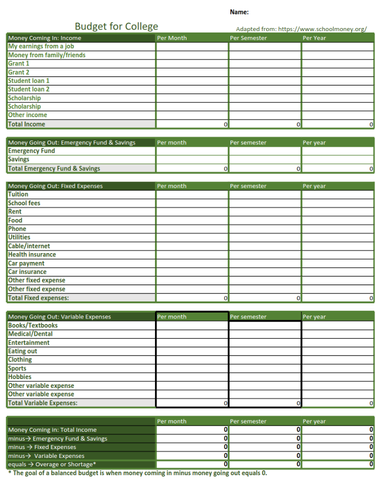
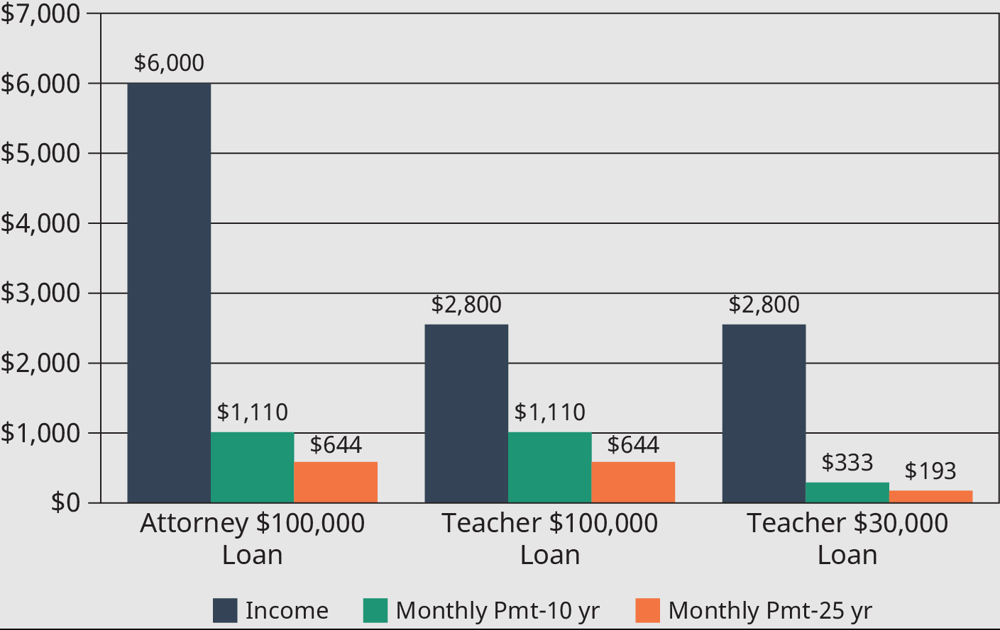
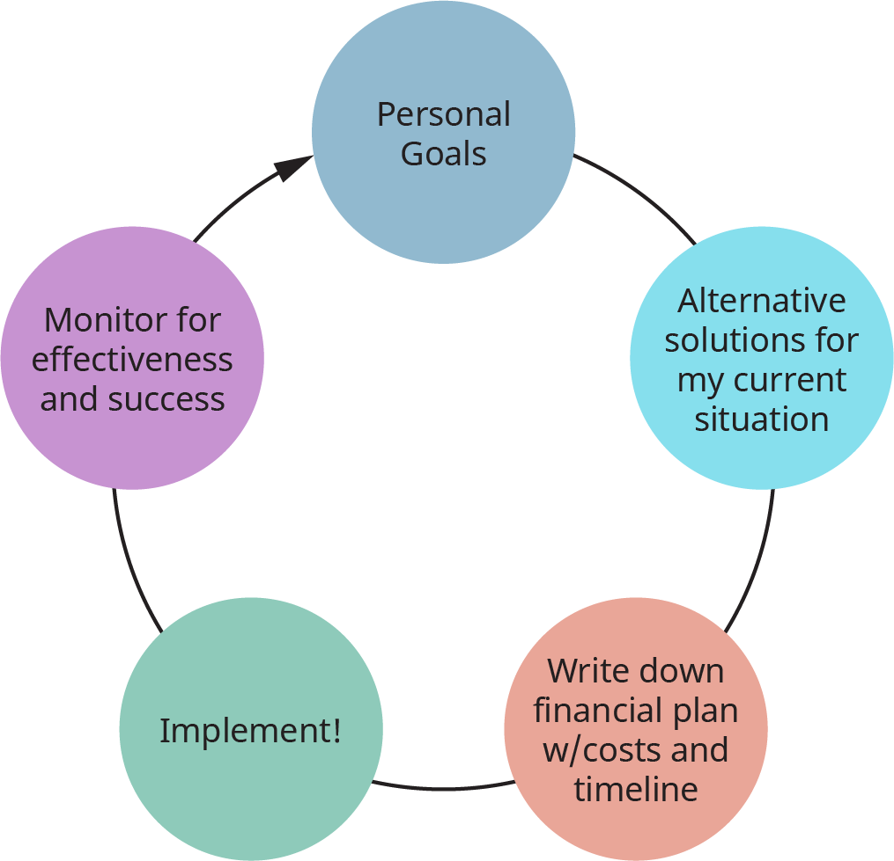
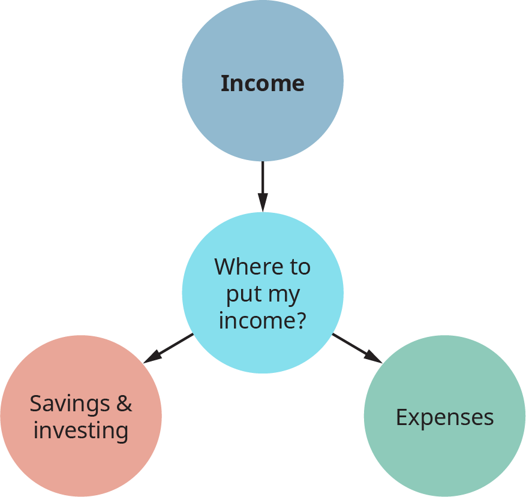

# Module 7 - Financial Education

<!-- TOC -->
* [Module 7 - Financial Education](#module-7---financial-education)
* [General Notes](#general-notes)
  * [Budgeting Resources](#budgeting-resources)
    * [Articles](#articles)
    * [Budgeting Sheet](#budgeting-sheet)
    * [Video Resources](#video-resources)
      * [Budgeting Basics!](#budgeting-basics-)
  * [Scholarship Resources](#scholarship-resources)
    * [Articles](#articles-1)
      * [Scholarships and Tips For Applying](#scholarships-and-tips-for-applying)
      * [Scholarship Websites](#scholarship-websites)
    * [Video Resources](#video-resources-1)
      * [Scholarship Tips](#scholarship-tips)
      * [What is a Scholarship?](#what-is-a-scholarship)
* [Module 7.1 - Financial Education Introduction](#module-71---financial-education-introduction)
* [Module 7.2 - Paying for College](#module-72---paying-for-college)
  * [Education Choices](#education-choices)
    * [Sample College Costs](#sample-college-costs)
  * [Keys to Success: Matching Student Debt to Post-graduation Income](#keys-to-success--matching-student-debt-to-post-graduation-income)
    * [Smart Borrowing Principles](#smart-borrowing-principles)
  * [Undergraduate Degree: 1 X Annual Salary](#undergraduate-degree--1-x-annual-salary)
  * [Advanced Degrees: 1 - 2 Annual Salary](#advanced-degrees--1---2-annual-salary)
  * [Types of Financial Aid: How to Pay for College](#types-of-financial-aid--how-to-pay-for-college)
    * [Credit Cards vs Student Loans](#credit-cards-vs-student-loans)
    * [Three Things To Stress](#three-things-to-stress)
  * [Grants and Scholarships](#grants-and-scholarships)
  * [Federal Grants](#federal-grants)
  * [State Grants](#state-grants)
  * [College/University Grants and Scholarships](#collegeuniversity-grants-and-scholarships)
  * [Private Organization Grants and Scholarships](#private-organization-grants-and-scholarships)
  * [Employer Grants and Scholarships](#employer-grants-and-scholarships)
  * [Additional Federal Support](#additional-federal-support)
    * [Education Tax Credits](#education-tax-credits)
    * [Federal Work-Study Program](#federal-work-study-program)
    * [Student Loans](#student-loans)
      * [Direct Subsidized Loans](#direct-subsidized-loans)
      * [Direct Unsubsidized Loans](#direct-unsubsidized-loans)
    * [Other Loan Types](#other-loan-types)
      * [Direct PLUS Loans](#direct-plus-loans)
    * [Private loans](#private-loans)
  * [Financial Aid and Loan Repayment Strategies](#financial-aid-and-loan-repayment-strategies)
    * [Applying for Financial Aid, FAFSA, and Everything Else](#applying-for-financial-aid-fafsa-and-everything-else)
    * [Maintaining Financial Aid](#maintaining-financial-aid)
    * [What to Do with Extra Financial Aid Money](#what-to-do-with-extra-financial-aid-money)
    * [Your Rights as a Loan Recipient](#your-rights-as-a-loan-recipient)
    * [Repayment Strategies](#repayment-strategies)
    * [Payment Plans](#payment-plans)
    * [Loan Forgiveness Programs](#loan-forgiveness-programs)
    * [Consider Professional Advice](#consider-professional-advice)
      * [Importance of Professional Advice](#importance-of-professional-advice)
  * [Student Loans 101 - Video](#student-loans-101---video)
* [Module 7.3 - Personal Financial Planning](#module-73---personal-financial-planning)
  * [Personal Financial Planning](#personal-financial-planning)
    * [Importance of Money Management](#importance-of-money-management)
    * [Tips for Effective Money Management](#tips-for-effective-money-management)
    * [Additional Information](#additional-information)
    * [Conclusion](#conclusion)
    * [Top Student Concerns](#top-student-concerns)
      * [What is your top immediate financial priority?](#what-is-your-top-immediate-financial-priority)
      * [Which aspect of your finances concerns you the most?](#which-aspect-of-your-finances-concerns-you-the-most)
      * [When considering how to pay for college, which of the following do you know least about?](#when-considering-how-to-pay-for-college-which-of-the-following-do-you-know-least-about)
  * [Financial Planning in Five Steps](#financial-planning-in-five-steps)
  * [How To Use Financial Planning in Everyday Life](#how-to-use-financial-planning-in-everyday-life)
    * [1. Develop Goals](#1-develop-goals)
    * [2. Identify and Evaluate Alternatives for Achieving Goals in Your Current Situation](#2-identify-and-evaluate-alternatives-for-achieving-goals-in-your-current-situation)
    * [3. Write Down Your Financial Plan](#3-write-down-your-financial-plan)
      * [Example Financial Plans](#example-financial-plans)
    * [4. Implement Your Plan](#4-implement-your-plan)
    * [5. Monitor and Adjust the Plan to Changing Circumstances and New Life Goals](#5-monitor-and-adjust-the-plan-to-changing-circumstances-and-new-life-goals)
  * [Use the Financial Planning Process for Everything](#use-the-financial-planning-process-for-everything)
  * [Why You Need An Emergency Fund - Video](#why-you-need-an-emergency-fund---video)
* [Module 7.4 - Savings, Expenses, and Budgeting](#module-74---savings-expenses-and-budgeting)
  * [Importance of Budgeting](#importance-of-budgeting)
  * [Elements of a Budget](#elements-of-a-budget)
  * [Income](#income)
  * [Saving and Investing](#saving-and-investing)
  * [Expenses](#expenses)
  * [Balancing Your Budget](#balancing-your-budget)
  * [Tracking the Big Picture](#tracking-the-big-picture)
  * [Good Practices vs. Bad Practices](#good-practices-vs-bad-practices)
  * [Get Connected](#get-connected)
  * [Good Spending vs Bad Spending - Video](#good-spending-vs-bad-spending---video)
* [Module 7.5 - Debt and Credit Cards](#module-75---debt-and-credit-cards)
  * [The Danger of Debt](#the-danger-of-debt)
  * [Compounding Interest](#compounding-interest)
  * [Sacrificing Your Future Fun](#sacrificing-your-future-fun)
  * [How Much Good Debt to Take On](#how-much-good-debt-to-take-on)
  * [Signs You Have Too Much Debt](#signs-you-have-too-much-debt)
  * [Difference between Debit and Credit Cards](#difference-between-debit-and-credit-cards)
  * [Benefits of a Credit Card](#benefits-of-a-credit-card)
    * [Secure and Convenient Method of Making Purchases](#secure-and-convenient-method-of-making-purchases)
    * [Greater Consumer Protections](#greater-consumer-protections)
    * [Builds Credit Score](#builds-credit-score)
  * [What Is a Good Credit Score?](#what-is-a-good-credit-score)
    * [Description of Credit Scores](#description-of-credit-scores)
  * [Components of a Credit Score and How to Improve Your Credit](#components-of-a-credit-score-and-how-to-improve-your-credit)
  * [How to Use a Credit Card](#how-to-use-a-credit-card)
  * [What to Look for in Your First Credit Card](#what-to-look-for-in-your-first-credit-card)
* [Module 7 - Summary](#module-7---summary)
  * [Overview](#overview)
  * [Main Description](#main-description)
<!-- TOC -->

# General Notes

## Budgeting Resources

### Articles

- [18 Budgeting Tips to Make Money Management](https://mint.intuit.com/blog/budgeting/tips/)
- [Budgeting 101: How to Make a Budget in 5 Actionable Steps](https://mint.intuit.com/blog/budgeting/budgeting-101/)

### Budgeting Sheet

> **College Budgeting Sheet:** [PDF](assets/college_budgeting_sheet.xlsx)
>
> 

### Video Resources

#### Budgeting Basics!

---

## Scholarship Resources

### Articles

#### Scholarships and Tips For Applying

- [Education Debt: Paying for College](https://open.maricopa.edu/strategiesforfirstyearcollegesuccess/chapter/education-debt-paying-for-college/) -
  **OER**
- [15 Expert Tips on How to Apply for Scholarships](https://myscholly.com/how-to-win-college-scholarships/) -
  **scholly.com**
- [Scholarship Basics and Tips](https://studentaid.gov/articles/scholarship-tips/) -
  **Federal Student Aid**

#### Scholarship Websites

- [MCCCD Foundation Scholarships](https://mcccd.scholarships.ngwebsolutions.com/CMXAdmin/Cmx_Content.aspx?cpId=1395)
- [Arizona Based Scholarships](https://www.azfoundation.org/Scholarships/Scholarship-Opportunities)
- [FastWeb](https://www.fastweb.com/)
- [CGC Scholarships](https://www.cgc.edu/admissions/financial-aid/scholarships)

---

### Video Resources

#### Scholarship Tips

---

#### What is a Scholarship?

---

# Module 7.1 - Financial Education Introduction

Students looking to be financially stable when they graduate should:

- Become knowledgeable of the available resources
- Develop clear short-term and long-term goals
- Make mindful choices

Some useful terms:

- **Financial literacy/Financial education**
    - Refers to receiving financial knowledge
      and know-how, so you can make informed decisions about your finances.
- **Financial well-being**
    - The goal of financial education, much like the goal of
      nutrition and exercise is health and well-being.
- **Financial Aid**
    - Refers to federal assistance for paying for college.
    - This assistance may include grants, federal loans, and even federal
      work-study.
    - The term Financial Aid can also refer to the campus department assisting
      students with applying for Financial Aid.
- **Interest**
    - Money paid for the use of money.
    - This can be money you pay as part of a loan when you borrow money, but it
      can also be money a bank or credit union pays to you on your savings
      account.
- **Compound interest**
    - Interest on interest.
    - If you purchase an item with your
      credit card and don't pay the amount in full, then you're charged
      interest. The following month you'll be charged interest, not only on the
      purchase but also on the first month's interest
        - It will continue until the purchase
          and all interest charges have been paid. This is compound interest
          working against you, and you want to avoid this at least on consumer
          debt.
        - Compound interest can also work for you on your savings account and
          with many investments.

# Module 7.2 - Paying for College

> _“An investment in knowledge always pays the best interest.”_
>
> —Benjamin Franklin, _The Way to Wealth: Ben Franklin on Money and Success_

## Education Choices

College success from a financial perspective means that you must:

- Know the total cost of the education
- Consider job market trends
- Work hard at school during the education
- Pursue ways to reduce costs

**Most importantly:** Buy only the amount of education that returns more than
you invest.

### Sample College Costs

| Type of School                          | Annual Tuition without Housing | Tuition If Living on Campus | Total Cost at Planned Completion |
|:----------------------------------------|--------------------------------|:----------------------------|:---------------------------------|
| Community College (2 yr.)               | $3,726                         | Live at Home                | $7,452                           |
| Public University, In-State (4 yr.)     | $9,716                         | Live at Home                | $38,864                          |
| Public University, In-State (4 yr.)     | &nbsp;                         | $19,716                     | $78,864                          |
| Public University, Out of State (4 yr.) | $21,629                        | $31,629                     | $126,516                         |
| Private College (4 yr.)                 | $35,676                        | $45,676                     | $182,704                         |

## Keys to Success: Matching Student Debt to Post-graduation Income

- The amount of debt you take on should be tied to the income you expect.
    - A layer making $120k their first year and having $100k-$200k debt is
      reasonable. A teacher making $40k their first year with this same debt is
      not.

### Smart Borrowing Principles

<strong>Smart Borrowing Principles</strong>

<ol>
<li><strong>Know your borrowing capacity:</strong> The first step in smart borrowing is to understand your borrowing capacity. This involves assessing your income, expenses, and other financial obligations to determine how much you can realistically afford to borrow. It’s important to be realistic about your borrowing capacity to avoid overextending yourself financially.</li>
<li><strong>Shop around for the best deal:</strong> When borrowing money, it’s important to shop around for the best deal. This means comparing interest rates, fees, and terms from different lenders to find the most affordable and suitable loan for your needs. Don’t just settle for the first offer you receive - take the time to explore your options and negotiate with lenders to get the best deal possible.</li>
<li><strong>Understand the terms and conditions:</strong> Before signing any loan agreement, it’s important to read and understand the terms and conditions. This includes the interest rate, fees, repayment schedule, and any other conditions attached to the loan. Make sure you fully understand your obligations as a borrower and ask questions if anything is unclear.</li>
<li><strong>Borrow only what you need:</strong> It’s important to borrow only what you need, rather than taking on more debt than you can handle. This means carefully assessing your financial needs and budgeting accordingly. Remember, every dollar you borrow comes with interest and fees, which can quickly add up over time.</li>
<li><strong>Have a repayment plan:</strong> When borrowing money, it’s important to have a repayment plan in place. This means understanding how much you need to repay each month and ensuring that you have the means to make those payments on time. If you’re struggling to make repayments, don’t hesitate to contact your lender to discuss your options.</li>
<li><strong>Avoid borrowing to cover everyday expenses:</strong> Finally, it’s important to avoid borrowing to cover everyday expenses. This can quickly lead to a cycle of debt that’s difficult to escape. Instead, focus on building up an emergency fund and using credit only for larger expenses or investments that will improve your financial situation over time.</li>
</ol>

In conclusion, smart borrowing guidelines are a useful tool for anyone considering borrowing money. By following these principles and practices, you can ensure that you borrow responsibly and effectively, while avoiding the pitfalls of debt and financial stress.

The first step in applying the Smart Borrowing Guideline is to:

1. First research the annual entry level (aka first year) salary for your
   desired career, in the geographic area where you intend to work.
2. Make that amount your self-imposed cap.
    - The maximum amount that you'll borrow.
3. Consider two additional things:
    1. The education level required for that career
    2. The estimated cost for obtaining that education level.
4. Keep in mind that education costs will increase beyond community college and
   will increase further for graduate degrees.

<u>_Employment Income and Assumed Debt:_</u>

- _Based on information from the National Association of Colleges and Employers
  and US Bureau of Labor Statistics._

## Undergraduate Degree: 1 X Annual Salary

For students working toward a bachelor’s or associate degree (both types of
undergraduate degrees) you should try to keep your student loans equal to or
less than your expected first year’s salary.

## Advanced Degrees: 1 - 2 Annual Salary

Advanced degrees can often double your expected annual salary, meaning that
your total debt for all your degrees should be equal to or less than twice your
expected first job income: **total debt &le; (2 * first job income)**

- Pay for college using multiple methods so the student loan debt can be as
  small as possible, rather than just making low monthly payments on a large
  loan that will lead to a higher overall cost.

## Types of Financial Aid: How to Pay for College

The **price tag** for a school is the cost before grants, scholarships, and
education tax benefits are factored in.

- The **net cost** is after those things have been factored in.

<u>_Average Published Yearly Tuition of Different Types of Colleges:_</u>

| Type of College                                 | Average Published Yearly Tuition and Fees |
|:------------------------------------------------|:------------------------------------------|
| Public Two-Year College (in-district students)  | $3,440                                    |
| Public Four-Year College (in-state students)    | $9,410                                    |
| Public Two-Year College (out-of-state students) | $23,890                                   |
| Private Four-Year College                       | $32,410                                   |

**Free Application for Student Aid (FAFSA)** provides free financial aid to
qualifying families and federal loans with lower interest rates and better
repayment terms than available anywhere else.

### Credit Cards vs Student Loans

<u>Student Loans:</u>

- Average interest rates on federal student
  loans: [2.75% to 5.30%](https://www.bankrate.com/loans/student-loans/current-interest-rates/)

- Average interest rates on private student
  loans: [3.34% to 12.99%](https://www.bankrate.com/loans/student-loans/current-interest-rates/)

<u>Credit Cards:</u>

- Average APR: **15.56%** to **22.87%**

**Sources:**

1. [CNBC.com](https://www.cnbc.com/select/average-interest-rate-on-private-and-federal-student-loans/)
2. [US News and World Report](https://creditcards.usnews.com/articles/average-apr)

Also keep in mind that loans may be part of a financial aid package, so it's
possible you may have already started borrowing.

### Three Things To Stress

1. It’s important to apply for financial aid.
2. It’s important to understand your financial aid award offer and to only
   borrow what you absolutely need
3. To be a smart borrower by keeping your borrowing well below your anticipated,
   first year income (see the smart borrowing guideline).
    - Keep in mind that while community college can take you halfway through on
      your way to your Bachelor’s degree, tuition and other costs beyond
      community college will be higher (could we give some type of estimate such
      as 3x the cost of community college or something like that).

## Grants and Scholarships

- Grants and scholarships are free money you can use to pay for college.
- While some grants and scholarships are based on a student’s academic record,
  many are given to average students based on their major, ethnic background,
  gender, religion, or other factors.

## Federal Grants

- **Federal Supplemental Educational Opportunity Grants (FSEOGs)** are
  additional free money available to students with financial need.
    - Through the FSEOG program, you can receive up to an additional $4,000
      in free money.
    - These grants are distributed through your school’s financial aid
      department on a first-come, first-served basis, so pay close attention to
      deadlines.
- **Teacher Education Assistance for College and Higher Education (TEACH)**
  Grants are designed to help students who plan to go into the teaching
  profession.
    - You can receive up to $4,000 per year through the TEACH Grant.
    - To be eligible for a TEACH Grant, you must take specific classes and
      majors and must hold a qualifying teaching job for at least four years
      after graduation.
        - If you do not fulfill these obligations, your TEACH Grant will be
          converted to a loan, which you will have to pay back with both
          interest and back interest.
- There are numerous other grants available through individual states,
  employers, colleges, and private organizations.

## State Grants

- Most states also have grant programs for their residents, often based on
  financial need.
- Eleven states have even implemented free college tuition programs for
  residents who plan to continue to live in the state.
- Check your school’s financial aid office and your state’s department of
  education for details.

## College/University Grants and Scholarships

Most colleges and universities have their own scholarships and grants.

- These are distributed through a wide variety of sources, including:
    - The school’s financial aid office
    - The school’s endowment fund
    - Individual departments
    - Clubs on campus.

## Private Organization Grants and Scholarships

A wide variety of grants and scholarships are awarded by:

- foundations
- civic groups
- companies
- religious groups
- professional organizations
- charities

Most are small awards under $4,000, but multiple awards can add up to large
amounts of money each year.

Your financial aid office can help you find these opportunities.

## Employer Grants and Scholarships

Many employers also offer free money to help employees go to school.

- A common work benefit is a tuition reimbursement program, where employers will
  pay students extra money to cover the cost of tuition once they’ve earned a
  passing grade in a college class.
- Some companies are going even further, offering to pay 100 percent of college
  costs for employees.
- Employers in certain fields, such as healthcare, may offer their own grants
  and scholarships.

## Additional Federal Support

### Education Tax Credits

- The IRS provides two education tax credits:
    1. American Opportunity Tax Credit (AOTC)
        - Refunds up to $2,500 of qualifying education expenses per eligible
          student.
        - Can only be claimed for four years per student.
    2. Lifetime Learning Credit (LLC)
        - Refunds up to $2,000 per year, regardless of the number of qualifying
          students.
        - Has fewer limitations and has no limit on the number of years you can
          claim it.
        - Lifetime learners and nontraditional students may consider the LLC a
          better choice.
        - It's important to calculate the benefits for your situation and choose
          the credit accordingly.

- Taxpayers must be careful when claiming the credits to avoid potential
  penalties. Consulting a tax professional or financial adviser is recommended.

### Federal Work-Study Program

- The Federal Work-Study Program provides part-time jobs to students enrolled in
  colleges and universities.
- The program offers students the opportunity to work in their field, for their
  school, or for a nonprofit or civic organization to help pay for the cost of
  college.
- The program is offered through the school's financial aid office if the school
  participates.

### Student Loans

- Federal student loans are offered by the US Department of Education to give
  easy and inexpensive access to loans for school.
- Payments on the loans are not required while you are in school, and the
  interest on the loans is tax-deductible for most people.
- **Direct Loans**, also called **Federal Stafford Loans**, have a competitive
  fixed interest rate and don’t require a credit check or cosigner.

#### Direct Subsidized Loans

- Direct Subsidized Loans are federal student loans on which the government pays
  the interest while you are in school.
- Qualifying students can get up to $3,500 in subsidized loans in their first
  year, $4,500 in their second year, and $5,500 in later years of their college
  education.
- The loans are made based on financial need as calculated from the information
  provided in your application.

#### Direct Unsubsidized Loans

- Direct Unsubsidized Loans are federal loans on which you are charged interest
  while you are in school.
- The amount you can borrow each year depends on numerous factors, with a
  maximum of $12,500 annually for undergraduates and $20,500 annually for
  professional or graduate students.
- It's best to make loan payments or at least pay the interest while in school
  to avoid the interest being added to the loan amount each year, resulting in a
  larger student loan balance when you graduate.
- Aggregate loan limits also apply to put a maximum cap on the total amount you
  can borrow for student loans.

### Other Loan Types

#### Direct PLUS Loans

- Direct PLUS Loans are additional loans a parent, grandparent, or graduate
  student can take out to help pay for additional costs of college.
- The maximum PLUS loan you can receive is the remaining cost of attending the
  school.
- PLUS loans require a credit check and have higher interest rates, but the
  interest is still tax-deductible.
- Whoever is on the loan is responsible for the loan forever, and the loan
  generally cannot be forgiven in bankruptcy. The government can also take
  Social Security benefits should the loan not be repaid.

### Private loans

- Private loans are available for students who need them from banks, credit
  unions, private investors, and even predatory lenders.
- Private loans require a credit check and potentially a cosigner, and they
  usually have higher interest rates, with the interest not being
  tax-deductible.
- As a general rule, private student loans should be avoided or used with
  caution as there are other resources for paying for college.

## Financial Aid and Loan Repayment Strategies

### Applying for Financial Aid, FAFSA, and Everything Else

- The Free Application for Federal Student Aid (FAFSA) is a standard form
  offered by the federal government that qualifies students for federal
  financial aid and opens doors for nearly all other financial aid.
- Most grants and scholarships require FAFSA, and they base their decisions on
  the information in the application.
- You need to file a FAFSA for each year you are in college, as your financial
  needs may change over time.
- You can apply for the FAFSA through your college’s financial aid office or
  at [studentaid.gov](https://studentaid.gov/).

### Maintaining Financial Aid

- To maintain financial aid, you need to meet the eligibility requirements for
  each year you are in school.
- The basic requirements include being a US citizen or eligible noncitizen,
  having a valid Social Security number, and registering for selective service
  if required.
- You also must make satisfactory academic progress, including meeting a minimum
  grade-point average, taking and completing a minimum number of classes, and
  making progress toward graduation or a certificate.

### What to Do with Extra Financial Aid Money

- It is important to only borrow what you truly need and to consider saving
  extra financial aid money for future education expenses or emergencies.
- Spending financial aid money on non-education expenses is a major contributor
  to student loan debt and can make it harder for you to afford important
  expenses after you graduate.

### Your Rights as a Loan Recipient

- As a recipient of a federal student loan, you have the same rights and
  protections as you would for any other loan.
- You have the right to know the terms and conditions for any loan before
  signing the paperwork, and you can dispute any loan or information on your
  credit file.
- Debt collectors can only call you between 8 a.m. and 9 p.m., and they also
  cannot harass you, threaten you, or call you at work once you’ve told them to
  stop.
- Federal student loans also come with many other rights, including the right to
  put your loan in deferment or forbearance (pushing pause on making payments)
  under qualifying circumstances.
    - Deferment or forbearance can be granted if you lose your job, go back to
      school, or have an economic hardship.
    - If you have a life event that makes it difficult to make your payments,
      immediately contact the student loan servicing company on your loan
      statements to see if you can pause your student loan payments.
- The **Consumer Financial Protection Bureau (CFPB)** has created a series
  of [sample letters](https://openstax.org/l/debtcollectors) you can use to
  respond to a debt collector.
- You can also [file a complaint](https://openstax.org/l/consumercomplaint) with
  the CFPB if you believe your rights have been violated.

### Repayment Strategies

- The federal government offers eight separate loan repayment programs, each
  with their way of calculating the payment you owe.
- Five of the programs tie loan payments to your income, which can make it
  easier to afford your student loans when you are starting off in your career.
- Federal loans generally offer the lowest interest rates and best repayment
  terms, so refinancing your student loans into a private loan may be the worst
  option available to you.

### Payment Plans

- The standard repayment plan sets a consistent monthly payment to pay off your
  loan within 10 years (or up to 30 years for consolidated loans).
- You can choose a graduated repayment plan, which will begin with lower
  payments and then increase the payment every two years.
- The extended repayment plan provides a fixed or graduated payment for up to 25
  years.
- The government offers five income-based repayment options, can make it easier
  to afford your student loans when you are just starting off in your career,
  including:
    - **Pay As You Earn (PAYE) repayment plan**
    - **Revised Pay As You Earn (REPAYE) repayment plan**
    - **Income-Based Repayment (IBR) plan**
    - **Income-Contingent Repayment (ICR) plan**
    - **Income-Sensitive Repayment (ISR) plan**

### Loan Forgiveness Programs

- Many income-based repayment options have a loan forgiveness feature built into
  the repayment plan.
    - At the end of the plan repayment term (typically 20 to 30 years), any
      remaining loan balance will be forgiven.
- The **Public Service Loan Forgiveness (PSLF)** program offers loan forgiveness
  after working for ten years in a qualifying public service job and making 120
  on-time payments on your loans.
    - A major advantage of PSLF is that the loan forgiveness may not be taxed as
      income in the year the loan is forgiven.
- Forgiveness comes with a catch: any forgiven balance will be counted and taxed
  as income during that year.

### Consider Professional Advice

- The complexity of payment and forgiveness programs can make it difficult for
  non-experts to choose the best strategy to minimize costs.
- Strict rules and potential tax implications create a minefield of potential
  financial problems.
- In 2017, first-year graduates were eligible for the PSLF program, but 99% of
  applicants were denied due to misunderstandings of the program or not meeting
  the eligibility requirements.

#### Importance of Professional Advice

- It is crucial to seek professional advice when navigating payment and
  forgiveness programs.
- Professionals can provide guidance on the best strategy to minimize costs and
  avoid potential financial problems.
- Seeking professional advice can increase the likelihood of successfully
  navigating loan forgiveness programs.

## Student Loans 101 - Video

**YouTube Video:** <https://www.youtube.com/embed/H9TpAPsf8V4>

# Module 7.3 - Personal Financial Planning

> _"If you fail to plan, you are planning to fail."_
>
> &mdash;Benjamin Franklin

## Personal Financial Planning

### Importance of Money Management

- Money management is similar to playing a video game.
    - The more you practice and learn the rules, the better you can get at it.
- It's not enough to figure it out as you go, a well-researched plan is
  necessary.
- Research has shown that people with stronger finances have better overall
  well-being, including better health, happiness, marriages, and cognitive
  functioning.

### Tips for Effective Money Management

- Create a budget and stick to it.
- Track your expenses to better understand your spending habits.
- Pay off high-interest debts first.
- Build an emergency fund.
- Start investing early for retirement.
- Regularly review and adjust your financial plan as necessary.

### Additional Information

- Personal financial planning is important for everyone, regardless of their
  income level or financial goals.
- There are many resources available, such as financial advisors, online
  budgeting tools, and educational courses, to help individuals improve their
  money management skills.

### Conclusion

Effective personal financial planning requires a well-researched plan,
discipline, and consistent effort. By implementing key money management
strategies, individuals can improve their overall financial well-being and
achieve their financial goals.

### Top Student Concerns

- **Anonymous _What Students Say_ Survey:
  ** <https://open.maricopa.edu/strategiesforfirstyearcollegesuccess/?p=384#h5p-29>

#### What is your top immediate financial priority?

---

#### Which aspect of your finances concerns you the most?

---

#### When considering how to pay for college, which of the following do you know least about?

---

## Financial Planning in Five Steps

1. Develop Personal Goals
    - What do I want my life to look like?
2. Identify and Evaluate Alternatives for Achieving Goals for My Situation
    - What do my savings, debt, income, and expenses look like?
    - What creative ways are available to get the life I want?
3. Write My Financial Plan
    - What small steps can I take to start working toward my goals?
4. Implement the Plan
    - Begin taking those steps, even if I can only do a few small things each
      week.
5. Monitor and Adjust the Plan
    - Make sure I don’t get distracted by life. Keep taking those small steps
      each week. Make adjustments when needed.

## How To Use Financial Planning in Everyday Life

Financial planning can help individuals achieve their goals and get better deals
when making purchases. The following notes are based on an example of using
financial planning to buy a car:

### 1. Develop Goals

- Before deciding to buy a car, consider alternatives such as taking the bus,
  train, carpooling, or biking.
- Determine if buying a car will impact other goals, such as saving for
  retirement or an emergency fund.
- Starting an emergency fund is an important first financial goal.
    - A smaller goal of $300-$500 can be set initially, and then increased
      gradually.
    - The emergency fund should be kept in a separate savings account to avoid
      confusion with other funds.
    - The emergency fund should be 3-6 months' worth of income.
- Keep your emergency fund in a separate bank account _(possibly even with a
  different bank entirely)._

### 2. Identify and Evaluate Alternatives for Achieving Goals in Your Current Situation

- Consider buying a used car, as a new car loses one-fifth of its value during
  its first year.
    - Buy a car that is 5-6 years old for the best deal
- Research total cost of ownership for each car, including maintenance, repairs,
  gas, and insurance, before making a decision.
    - [Kelley Blue Book](https://www.kbb.com/)
    - [Edmunds](https://www.edmunds.com/)
- Weigh all factors before making any major purchase.

### 3. Write Down Your Financial Plan

- Create a written financial plan to help stay on track.
- Include goals, items, details, budget, and timeline.
- An example financial plan for a car and computer is provided.

#### Example Financial Plans

|         Goal         | Item                                                          | Details                                                    | Budget                                                                                                                                                                                    | Timeline                                                                                                                                             |
|:--------------------:|:--------------------------------------------------------------|:-----------------------------------------------------------|:------------------------------------------------------------------------------------------------------------------------------------------------------------------------------------------|------------------------------------------------------------------------------------------------------------------------------------------------------|
| Transportation / Car | 2017 Toyota Camry                                             | Black, A/C, power windows, less than 60,000 miles          | Car $20,000 (max)  Down payment $4,000   Insurance $100/mo  Sales tax $1500  + Licensing $200  ---------------------------  Cash needed $5800 | Have $4600 in savings for this.  Save $100/week.  Purchase in approximately 12 weeks.                                                  |
|       Computer       | Used or refurbished laptop or borrowed or rented from college | Dell w/ Windows, minimum 13″, 128G hard drive, HD Graphics | $300  Use free Windows update from school.  Use free Wi-Fi at school.                                                                                                     | Sell current laptop for $100.    Buy refurbished from Dell site for $289.    $189 on credit card.    Pay off when statement comes. |

### 4. Implement Your Plan

- Do research online with resources such as Kelley Blue Book to see what is
  available in the area.
- Contact dealerships and ask for their best offer and compare it to the
  researched price.
- Stick to the written plan when purchasing, and take a responsible friend or
  family member for support.

### 5. Monitor and Adjust the Plan to Changing Circumstances and New Life Goals

- Keep up with recommended maintenance on the car.
- Continue saving money for the emergency fund and next car.
- Keep making car payments once the car loan is paid off by putting the same
  amount into a savings account for the next car.
- The financial planning process can be used for every major purchase in life,
  such as renting an apartment or buying groceries.

## Use the Financial Planning Process for Everything

- Financial planning can be a useful tool for achieving goals and saving money.
- By considering alternatives, evaluating options, and creating a written plan,
  individuals can make informed decisions and get better deals on purchases.
- It's important to keep monitoring and adjusting the plan as needed to achieve
  new goals and accommodate changing circumstances.

## Why You Need An Emergency Fund - Video

# Module 7.4 - Savings, Expenses, and Budgeting

> _“Do not save what is left after spending; instead spend what is left after
> saving.”_
>
> — Warren Buffett

## Importance of Budgeting

- Financial planning requires a map, just like a route to a destination.
- Budgeting is the process of creating a spending and savings plan that tracks
  income and expenses.
- Checking progress is done using a balance sheet that lists **assets** and
  **liabilities**.
    - A balance sheet is like a snapshot, a moment in time, that we use to check
      our progress.

## Elements of a Budget

1. Income
2. Saving and investing
3. Expenses

## Income

- Income can come from jobs, disability, social security, investments, alimony,
  child support, scholarships, grants, student loan money, etc.
- Use net pay, or take-home pay, for monthly budgeting.
- Optional deductions include 401(k) or health insurance payments.
- To figure out your income in the gig economy, the key is to track your income
  for at least 30 days to come up with a weekly average income.

## Saving and Investing

- Prioritize saving and investing before paying bills and discretionary
  purchases.
- Building an emergency fund should be the first financial goal.
- Savings can also be for short-term goals such as education, weddings, travel,
  or cars.
- Investing offers higher returns at a higher risk than money saved in a bank.
- Retirement accounts can be automatically funded with money deducted from your
  paycheck.
- Diversify investments to reduce risk.
- Pay yourself first and make automatic payroll deductions to save money before
  spending.

## Expenses

There are two ways to categorize expenses:

- Expenses can be categorized as **fixed** or **variable**.
    - Fixed expenses are predictable
    - Variable expenses will vary from month to month.
- Expenses can also be categorized as **needs** or **wants**.
    - **Needs** come first:
        - Food
        - Basic clothing
        - Safe housing
        - Medical care
        - Water.
    - **Wants** may include:
        - Meals at a restaurant
        - Designer clothes
        - Video games
        - Other forms of entertainment
        - A new car
- Practice self-control to avoid overspending on wants.

## Balancing Your Budget

- Budgeting allows us to decide where to allocate our money
- We should not regularly have money left over or a negative balance
- If we have a shortfall, we can look at our income, savings, and expenses
- Options for increasing income:
    - Taking a second job
    - Working overtime
- Options for reducing expenses:
    - Cutting savings
    - Reducing expenses
- Taking on debt is usually not advisable, as it can make future cash shortages
  worse
- Adjust the budget based on actual spending from the previous month

## Tracking the Big Picture

- Net worth is the total measure of wealth:
  > **Assets (Owned) - liabilities (Owed) = Net Worth**
- The goal is to own more than you owe
- You can track your assets, liabilities, and net worth on a balance sheet or
  personal financial statement
- Increasing assets and decreasing liabilities over time will lead to positive
  net worth

## Good Practices vs. Bad Practices

| Good Practices That Build Wealth                | Bad Practices That Dig a Debt Hole                                 |
|:------------------------------------------------|:-------------------------------------------------------------------|
| Tracking all spending and saving                | Living paycheck to paycheck with no plan                           |
| Knowing the difference between needs and wants  | Spending money on wants instead of saving                          |
| Resisting impulse buying and emotional spending | Using credit to buy more than you need and increasing what you owe |

## Get Connected

- Use paper or computer spreadsheet to budget or find budgeting apps
- Popular budgeting apps include:
    - [Mint](https://www.mint.com/)
    - [Mvelopes](https://www.mvelopes.com/)
    - [Wally](https://wally.me/)
    - [Goodbudget](https://goodbudget.com/)
- Some apps link to accounts and offer other services such as tracking credit
  cards and credit score

## Good Spending vs Bad Spending - Video

# Module 7.5 - Debt and Credit Cards

> _"If you will live like no one else, later you can live like no one else."_
>
> &mdash;Dave Ramsey, American personal finance personality, radio show host,
> author,
> and businessman

## The Danger of Debt

- When you take out a loan, you commit your future income to the loan and pay
  interest through a monthly payment.
- Taking on too much debt can have disastrous effects on personal finances.
- Debt is a tool to help build wealth if used appropriately, but if not
  controlled, it can burn down your finances.
- Compounding interest works against you when you are paying interest on loans.

## Compounding Interest

- Credit cards and student loans are the two most common loans on which people
  get stuck paying compounding interest.
- To avoid compounding interest on loans, make sure your payments are at least
  enough to cover the interest charged each month.
- When you get a credit card, always pay the credit card balance down to $0 each
  month to avoid the compound interest trap.

## Sacrificing Your Future Fun

- Getting into debt while in college forces you to sacrifice your future fun.
- When you take out a loan, you sacrifice opportunities every month for decades.
- Make sure it's a good loan before taking out any loans.

## How Much Good Debt to Take On

- During college and for the first few years after graduation, most students
  should only have two loans: student loans and possibly a car loan.
- Student loans should be equal to or less than the first year’s expected salary
  after graduation.
- Car payments should be between 10 and 20 percent of your monthly take-home
  pay.
- Debt payments (plus rent if you are renting) should be no more than 44 percent
  of your take-home pay.
    - If planning to build wealth, cap debt payments at 30 percent of take-home
      pay.

## Signs You Have Too Much Debt

- Cannot make minimum credit card payments.
- Money is gone before the next paycheck.
- Bill collectors are contacting you.
- Unable to get a loan.
- Paycheck is being garnished by a creditor.
- Considering a debt consolidation loan with extra fees added.
- Items are repossessed.
- Do not know your debt or financial situation.

## Difference between Debit and Credit Cards

- Debit card is linked to your checking account and doesn't create debt, whereas
  a credit card creates debt until you pay it.
- Debit cards and credit cards can be used for most of the same things.

## Benefits of a Credit Card

### Secure and Convenient Method of Making Purchases

- Credit cards offer a secure and convenient way of making purchases.
- They are similar to using a debit card, but provide more security.
- Carrying cash has the potential of being lost or stolen, but credit or debit
  cards can be canceled and replaced at no cost.

### Greater Consumer Protections

- Credit cards offer greater consumer protections than debit cards.
- These consumer protections are written into law.
- With a credit card, you have a maximum liability of $50.
- With a debit card, you are responsible for transfers made up until you report
  the card stolen.
- To have the same protections as with credit cards, you need to report the card
  lost or stolen within 48 hours.
- Waiting longer to report the loss of the card, or taking longer to realize you
  lost it, may make you responsible for more money, up to an unlimited amount.

### Builds Credit Score

- A credit card allows you to build your credit score, which is helpful in many
  aspects of life.
- Credit scores are not only important to getting better rates on loans.
    - They are also important for getting a job, lowering car insurance rates,
      and finding an apartment.

## What Is a Good Credit Score?

- Most credit scores have a 300–850 score range.
- A "good" credit score is considered to be in the 670–739 score range.

### Description of Credit Scores

| Credit Score Ranges |     Rating      | Description                                                                                                                                           |
|:-------------------:|:---------------:|:------------------------------------------------------------------------------------------------------------------------------------------------------|
|      **< 580**      |    **Poor**     | This credit score is well below the average score of US consumers and demonstrates to lenders that the borrower may be a risk.                        |
|    **580 - 669**    |    **Fair**     | This credit score is below the average score of US consumers, though many lenders will approve loans with this score.                                 |
|    **670 - 739**    |    **Good**     | This credit score is near or slightly above the average of US consumers, and most lenders consider this a good score.                                 |
|    **740 - 799**    |  **Very Good**  | This credit score is well above the average score of US consumers and clearly demonstrates to lenders that the borrower is an exceptionally low risk. |
|      **800+**       | **Exceptional** | This credit score is above the average of US consumers and demonstrates to lenders that the borrower is very dependable.                              |

## Components of a Credit Score and How to Improve Your Credit

**Components of a Credit Score and How to Improve Your Credit**

Credit scores consist of five components:

1. Credit payment history (35%)
2. Credit utilization (30%)
3. Length of credit history (15%)
4. New credit (10%)
5. Credit mix (10%)

The main action to improve credit score is to:

- Pay bills on time
- Pay at least the minimum amount due
- Reduce credit utilization
- Avoid carrying a balance on credit cards

Paying more than the minimum amount due helps reduce debt load but usually has
no significant impact on credit score, except for reducing credit utilization
over time. However, paying bills late and owing more than 30% of available
credit can decrease credit score. Credit score reflects an individual's
willingness and ability to pay debts on time.

## How to Use a Credit Card

- Credit cards should be used as a method of paying for things you can afford.
- Every month, you should pay your credit card off in full to avoid paying
  interest.
- Avoid paying only the minimum payment each month as it can result in paying
  twice as much as the amount purchased and taking years to pay off a credit
  card.

## What to Look for in Your First Credit Card

- Find a low-rate credit card.
    - Lowest **annual percentage rate (APR)**
- Avoid cards with annual fees or minimum usage requirements.
- Keep the credit limit equal to two weeks' take-home pay.
- Avoid rewards cards until you build a strong habit of paying off your card in
  full each month.
    - Rewards systems with credit cards are designed by experts to get you to
      spend more money and pay more interest than you otherwise would.
    - Until you build a strong habit of paying off your card in full each
      month, don’t step into their trap.

# Module 7 - Summary

## Overview

This module aims to help people better understand the topic of money, which can
be emotionally charged, mysterious, and stressful. The lack of financial
education can lead to mistakes, and this module helps to dispel myths and break
down barriers to make people more comfortable with money.

## Main Description

- Money is essential for survival but can also be a source of stress and
  mystery.
- Many people are not taught how to manage their money, and some cultures
  consider it taboo to talk about money.
- High levels of stress can lead to financial mistakes.
- This module aims to help people feel more comfortable with the topic of money
  and understand its value.
    - It dispels money myths and breaks down barriers to financial education.
    - The module encourages people to continue their financial education.

