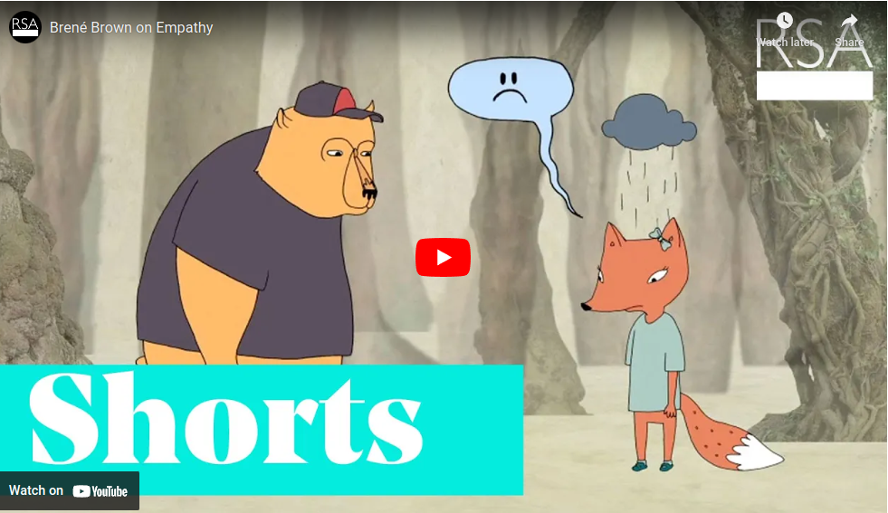
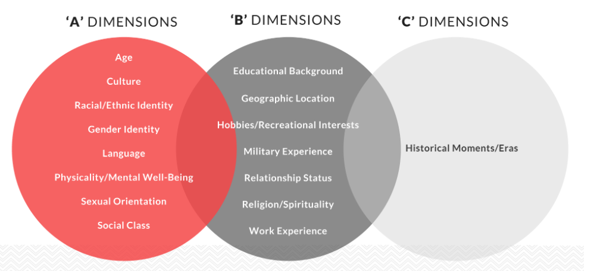
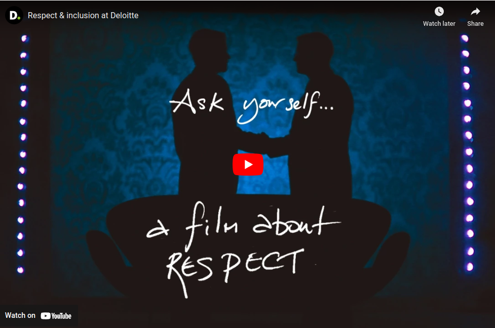
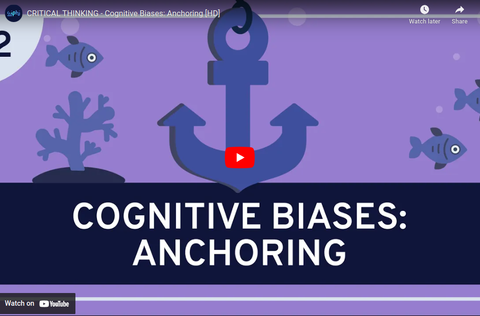

# Module 8 - Diverse World

<!-- TOC -->
* [Module 8 - Diverse World](#module-8---diverse-world)
* [General Notes](#general-notes)
* [Module 8.1 - Perspective](#module-81---perspective)
  * [Perspective](#perspective)
  * [Examples](#examples)
  * [Tips](#tips)
  * [Activity: Reflection](#activity--reflection)
  * [Conclusion](#conclusion)
* [Module 8.2 - Empathy & Respect](#module-82---empathy--respect)
  * [Empathy](#empathy)
    * [Video - Brené Brown on Empathy](#video---brené-brown-on-empathy)
  * [Respect](#respect)
  * [Civic Engagement](#civic-engagement)
  * [Conclusion](#conclusion-1)
* [Module 8.3 - Personal Identities and Careers](#module-83---personal-identities-and-careers)
  * [Personal Identity & Careers](#personal-identity--careers)
    * [How Diversity Benefits College & Career](#how-diversity-benefits-college--career)
  * [What Makes Us Different](#what-makes-us-different)
  * [Respect and Inclusion at Deloitte](#respect-and-inclusion-at-deloitte)
  * [Do certain backgrounds and experiences = specific degrees and/or careers?](#do-certain-backgrounds-and-experiences--specific-degrees-andor-careers)
  * [Opportunities for College Students](#opportunities-for-college-students)
  * [Networking](#networking)
  * [Critical Thinking - Cognitive Biases: Anchoring](#critical-thinking---cognitive-biases--anchoring)
  * [Conclusion](#conclusion-2)
* [Module 8 Summary](#module-8-summary)
  * [Diverse World](#diverse-world)
  * [References](#references)
  * [Conclusion](#conclusion-3)
<!-- TOC -->

# General Notes

# Module 8.1 - Perspective

> _"The greatest tragedy for any human being is going through their entire lives
believing the only perspective that matters is their own."_
>
> &ndash; Doug Baldwin

## Perspective

- Perspective is a "point of view."
- Everyone has a point of view, and it can differ from our own.
- Our opinions and thought processes can evolve when we keep an open mind and
  gather all the facts.
- Sometimes we think our opinion/thought process is correct, but we do not have
  all the facts.
- Often when people disagree, they are arguing over a "perspective" and not
  necessarily over facts.
- Understanding and appreciating diverse perspectives are crucial in a global
  society.

## Examples

- Cultures can be ethnic, racial, religious, regional, etc.
- Our backgrounds, experiences, and societal factors _(social economic
  status, **SES**)_ contribute to our individual perceptions and can affect our
  choices for:
    - **Going to college**
        - Is it the next step and expected for young adults in your neighborhood
          after high school graduation or are you the exception to the rule?
    - **Careers**
        - are you seeking professional degrees, certificates, or trade skills?
    - **Civic engagement**
        - is it common to see community members involved in your city, and
          participate in elections, or does everyone typically keep to
          themselves?

## Tips

- Keeping a "Worldview" perspective is easier when we remember not to have an
  egocentric attitude.
- Appreciating and understanding a different perspective is not right or wrong,
  just different, and everyone can contribute.

## Activity: Reflection

- Without any communication or opportunity to develop a new perspective and
  understand each other, they are stuck in their limited viewpoints.
- Both sets of women say the same words, but they may not be accurate in their
  statements due to cultural differences.
- Recognize and appreciate the differing perspective, listen and communicate
  effectively, and work towards a common goal.

## Conclusion

- It is essential to have an open mind and consider other perspectives while
  dealing with cultural differences.
- Keeping a worldview perspective can help us appreciate diversity, and everyone
  can contribute to society with their unique background, experiences, and
  perceptions.

# Module 8.2 - Empathy & Respect

> _"Empathy begins with understanding life from another person's perspective.
Nobody has an objective experience of reality. It's all through our own
individual prisms"._
>
> &ndash; Sterling K. Brown

## Empathy

- Empathy is the ability to understand (not just recognize) and share the
  feelings of another person.
    - Someone with this ability is someone who is **empathetic**.
- Practicing empathy towards others who are different from ourselves can create
  connections, establish friendships, and create academic and/or career
  networks.

### Video - Brené Brown on Empathy

- **Empathy** fuels connection, **sympathy** drives disconnection.
- The four qualities of empathy:
    - **Perspective taking**: Putting yourself in someone else's shoes.
    - **Staying out of judgment**: Not making assumptions about the other
      person's situation.
    - **Recognizing emotions**: Being able to identify the emotions of others.
    - **Communicating**: Being able to communicate your understanding of the
      other person's emotions.
- Empathy is a vulnerable choice, because in order to connect with someone, you
  have to connect to something in yourself that knows that feeling.
- An empathetic response **rarely** begins with _"at least"_.
    - Trying to silver-line everything is not empathy.
- A response cannot make something better, only a connection can.

## Respect

- Respect is the act of considering others as important and treating them with
  dignity.
- Respecting other cultures and their differing perspectives can be the deciding
  factor on whether you keep a job, do well in a class, or make a difference in
  the lives of others.
- Learning about different customs and communication styles can help in college,
  community, and career.
- The following communication styles may be encountered:
    - Some cultures converse with their faces only a few inches apart while
      others like to keep their distance.
    - Short wait times put some people at a disadvantage, while other cultures
      emphasize deliberate thought.
        - For example, the cultures of many Native Americans emphasize
          deliberate thought. Before making a decision, they learn to consider
          all possible implications.
    - It may be rude to establish direct eye contact with elders or people in
      authority in certain cultures.
        - _I.e. African, Asian, and Latin American cultures_
    - Some cultures consider small talk as a necessary part of business while
      others view it as a waste of time.
    - In some East Asian cultures, it is rude to answer a question in the
      negative and people may say "yes" even though they mean "no" to show
      respect.
    - Verbal challenges may be viewed positively in some cultures while they may
      be repressed in others.

## Civic Engagement

- Civic Engagement includes political activism, environmentalism, and community
  and national service.
- College students who volunteer and serve within the community gain valuable
  experience by developing professional networks, improving their resumes, and
  might even open doors to apply for other scholarships.
  prepare and serve meals to homeless members of the community.

## Conclusion

Empathy and respect are crucial skills to have in college and in life. They help
to build relationships, create understanding and connection, and foster a sense
of community. By developing these skills, you can navigate diverse social
situations and make a positive impact in your community. Remember, empathy
begins with listening and understanding the perspectives of others, while
respect involves treating others with dignity and valuing their cultural
differences.

# Module 8.3 - Personal Identities and Careers

> _"Diversity is the one true thing we all have in common... Celebrate it every
day."_
>
> &ndash; Winston Churchill

## Personal Identity & Careers

- Diversity involves recognizing and respecting the ideas, feelings, behaviors,
  and experiences of people different from oneself.
- Multiculturalism means living in a multicultural world and interacting with
  people from different backgrounds and experiences.
- Diversity is not just about race or ethnicity, it includes age, gender, sexual
  orientation, socio-economic status, political beliefs, and religion.
- Exposure to diverse experiences, thoughts, and backgrounds can benefit
  academic, career, and civic engagement.

### How Diversity Benefits College & Career

_Taken
from [OER College Success Chapter 9.2](https://open.lib.umn.edu/collegesuccess/chapter/9-2-living-with-diversity/)_

- Experiencing diversity at college prepares students for the diversity they
  will encounter in life.
- Students learn better in a diverse educational setting, leading to deeper,
  more complex, and more creative thinking and intellectual and academic skills.
- Attention to diversity leads to a broader range of teaching methods,
  benefiting the learning process for all students.
- Experiencing diversity on campus is beneficial for both minority and majority
  students, leading to more fulfilling social relationships, satisfaction, and
  involvement.
- Diversity experiences help break patterns of segregation and prejudice by
  promoting acceptance of differences.
- Students of a traditional college age are in an ideal stage of development for
  forming healthy attitudes about diversity.
- Experiencing diversity makes us all better citizens in our democracy by better
  understanding and considering the ideas and perspectives of others and
  advancing democratic government.
- Diversity enhances self-awareness by gaining insights into our own thought
  processes, life experiences, and values.

## What Makes Us Different

Dr. Patricia Arredondo, a previous professor in the Counseling Department at
ASU,
discusses [Dimensions of Personal Identity in the Workplace (2018)](https://www.arredondoadvisorygroup.com/2018/11/07/dimensions-of-personal-identity-in-the-workplace/)
and proposes the intersecting dimensions of identity.

---

| Dimensions of Identity | Description                                                                                                                                                                                                                               |
|:-----------------------|:------------------------------------------------------------------------------------------------------------------------------------------------------------------------------------------------------------------------------------------|
| **A Dimensions**       | Visible characteristics that can lead to both positive and negative stereotypes, including gender, ethnicity, race, sexual orientation, and age.                                                                                          |
| **B Dimensions**       | Not always visible and often come from individual backgrounds and experiences, including geographic origins, religions, educational backgrounds, recreational interests, family statuses, healthcare practices, and citizenship statuses. |
| **C Dimensions**       | Major moments in life that may be invisible, such as living through COVID-19 and stay-at-home orders, historical moments, natural disasters, and wars.                                                                                    |

- Respecting differences involves opening our minds and focusing on successes
  and positive contributions.
- Our individual identities are unique and deserve mutual respect.

## Respect and Inclusion at Deloitte

## Do certain backgrounds and experiences = specific degrees and/or careers?

- Certain backgrounds and experiences <u>**do not**</u> equate to specific
  degrees and careers.
- Individual societal factors, experiences, and backgrounds can have limits, but
  that doesn't mean you have to be limited.

## Opportunities for College Students

- Work-based experiences:
    - **Internships**
    - **Job shadows**
    - **Service learning**
        - A teaching and learning methodology which fosters civic responsibility
          and applies classroom learning through meaningful service to the
          community
    - **Volunteering**
- Participating with college clubs, student leadership, and campus events helps
  with diverse perspectives and experiences.
- Exposure to diverse perspectives and experiences.
- Gain experience in not only the professions they are interested in but also
  how to talk and interact with others, respect positions within the field, and
  make connections for potential employers.
- Completing one or all of these activities exposes students to multiple careers
  and begins to build their social network.

## Networking

- According to Bucher (2015) in his textbook, _Diversity Consciousness_,
  networking accounts for half of people finding
  jobs.
- Taking a wide variety of General Education Courses in college can help expose
  students to other careers.
- Cross-cultural social networking guidelines:
    - Be formal and respectful when introducing yourself to others.
    - Research ahead of time.
    - Avoid acronyms, idioms, and slang.
    - Learn "safe" topics of discussion.
    - Be mindful of how you present yourself online.
    - Be humble.
    - Respect and engage individuals and their cultures.
    - Manners matter.
    - Commit to learning one or two new keywords and phrases each day.

## Critical Thinking - Cognitive Biases: Anchoring

- Anchoring is a cognitive bias that occurs when we rely too heavily on the
  first piece of information we receive when making a decision.
- We create cognitive anchors and do not adjust as much as we need to. We use
  that starting point and only deviate a small amount from it.

## Conclusion

- Diversity involves recognizing and respecting the ideas, feelings, behaviors,
  and experiences of people different from oneself.
- Experiencing diversity can benefit academic, career, and civic engagement.
- The intersecting dimensions of identity include visible and invisible
  characteristics that make each individual unique and deserve mutual respect.
- College and career choices can be influenced by one's individual backgrounds,
  experiences, and beliefs.
- Embracing diversity can help break patterns of segregation and prejudice,
  promote acceptance of differences, and enhance self-awareness.
- By learning to appreciate and respect diversity, we can become better
  citizens, thinkers, and leaders in a multicultural world.
- Diversity is something to be celebrated every day.
- Our individual societal factors, experiences, and backgrounds can have limits,
  but that doesn't mean we have to be limited.
- Work-based experiences, college clubs, student leadership, and campus events
  can all help expose students to diverse perspectives and experiences.
- Networking and taking a wide variety of courses can also help students build
  their social network and explore new career paths.
- When making career choices, it's important to be mindful of biases and
  consider different perspectives to make informed decisions.

# Module 8 Summary

## Diverse World

- Students who have a worldview perspective understand that everyone has
  different backgrounds, identities, and experiences.
- Personal identity dimensions can intersect with academic and career choices as
  well as civic engagement.
- Empathy and respect towards people who are different from ourselves can lead
  to connections, friendships, and networks.

## References

- Arrendondo, P. (2018). _Dimensions of Personal Identity in the Workplace._
  Arrendondo Advisory Group.
    - <https://www.arredondoadvisorygroup.com/2018/11/07/dimensions-of-personal-identity-in-the-workplace/>
- Bucher, R. D. (2015). _Diversity Consciousness: Opening Our Minds to People,
  Culture, and Opportunities_ (4th edition). New York: Pearson.

- [OER, College Success Chapter 9.2](https://open.lib.umn.edu/collegesuccess/chapter/9-2-living-with-diversity/)

## Conclusion

Having a worldview perspective is essential for understanding the diverse world
we live in. It's crucial to have empathy and respect towards people who are
different from ourselves, as this can lead to establishing connections,
friendships, and networks.