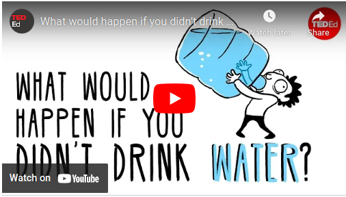

# Module 9 - Self-Care

<!-- TOC -->
* [Module 9 - Self-Care](#module-9---self-care)
* [General Notes](#general-notes)
* [Module 9.0 - Overview](#module-90---overview)
  * [Purposeful Body](#purposeful-body)
  * [Purposeful Mind](#purposeful-mind)
  * [Purposeful Emotions](#purposeful-emotions)
  * [Purposeful Connectedness](#purposeful-connectedness)
  * [Conclusion](#conclusion)
* [Module 9.1 - Self-Care](#module-91---self-care)
  * [Importance of Self Care for College Students](#importance-of-self-care-for-college-students)
  * [The Mechanics of Self-Care](#the-mechanics-of-self-care)
  * [Benefits of Self-Care](#benefits-of-self-care)
  * [Essential Aspects of Self-Care](#essential-aspects-of-self-care)
  * [Conclusion](#conclusion-1)
* [Module 9.2 - Purposeful Mind](#module-92---purposeful-mind)
  * [Purposeful Mind](#purposeful-mind-1)
    * [Mindfulness](#mindfulness)
    * [Mindfulness and Growth Mindset](#mindfulness-and-growth-mindset)
  * [Everyday Mindfulness](#everyday-mindfulness)
  * [Mindfulness "What" Skills](#mindfulness--what--skills)
    * [Observe](#observe)
    * [Describe](#describe)
    * [Participate](#participate)
  * [Mindfulness "How" Skills](#mindfulness--how--skills)
    * [Be Non-Judgmental](#be-non-judgmental)
    * [Stay Focused](#stay-focused)
    * [Do What Works](#do-what-works)
  * [Why Mindfulness Is a Superpower: An Animation](#why-mindfulness-is-a-superpower--an-animation)
  * [Conclusion](#conclusion-2)
* [Module 9.3 - Purposeful Body: Nutrition and Water](#module-93---purposeful-body--nutrition-and-water)
  * [Purposeful Body](#purposeful-body-1)
  * [Eat to Nourish](#eat-to-nourish)
  * [How Food Affects The Brain Video](#how-food-affects-the-brain-video)
  * [Brain Foods](#brain-foods)
  * [Cost of Food](#cost-of-food)
    * [Tips for Eating Healthy on a Budget _(Griffin 2017)_](#tips-for-eating-healthy-on-a-budget-griffin-2017)
  * [Benefits of Water Video](#benefits-of-water-video)
  * [Water and Nutrition](#water-and-nutrition)
    * [Tips to drink more water](#tips-to-drink-more-water)
  * [Resources](#resources)
  * [Conclusion](#conclusion-3)
* [Module 9.4 - Purposeful Body: Movement and Sleep](#module-94---purposeful-body--movement-and-sleep)
  * [Physical Activity](#physical-activity)
  * [Types of Physical Activity](#types-of-physical-activity)
  * [Sleep](#sleep)
    * [Impact of Poor Sleep](#impact-of-poor-sleep)
    * [Tips For Sleep](#tips-for-sleep)
  * [What Would Happen If You Didn't Sleep Video](#what-would-happen-if-you-didnt-sleep-video)
  * [Conclusion](#conclusion-4)
* [Module 9.5 - Purposeful Emotions: Awareness](#module-95---purposeful-emotions--awareness)
  * [Purposeful Emotions](#purposeful-emotions-1)
  * [Emotional Awareness](#emotional-awareness)
  * [Why Emotions Are Important Video](#why-emotions-are-important-video)
  * [Recognize Your Emotions](#recognize-your-emotions)
  * [A Few Things to Know About Emotions](#a-few-things-to-know-about-emotions)
    * [Emotions Arise and Pass](#emotions-arise-and-pass)
    * [Good or Bad Emotions](#good-or-bad-emotions)
    * [Emotional Reactivity](#emotional-reactivity)
    * [Cognitive Distortions and Emotional Responses](#cognitive-distortions-and-emotional-responses)
    * [Conclusion](#conclusion-5)
  * [Common Cognitive Distortions and Tips to Overcome](#common-cognitive-distortions-and-tips-to-overcome)
  * [Conclusion](#conclusion-6)
* [Module 9.6 - Purposeful Emotions: Learning](#module-96---purposeful-emotions--learning)
* [Module 9.6: Purposeful Emotions: Learning and Self-Care](#module-96--purposeful-emotions--learning-and-self-care)
  * [Emotions and Learning](#emotions-and-learning)
  * [Creating Pleasant Emotional Experiences](#creating-pleasant-emotional-experiences)
  * [Ways to Care for Yourself When Painful Emotions Arise](#ways-to-care-for-yourself-when-painful-emotions-arise)
    * [The Three Components of Self-Compassion](#the-three-components-of-self-compassion)
  * [Deep Breathing](#deep-breathing)
  * [Meditation](#meditation)
  * [Conclusion](#conclusion-7)
* [Module 9.7 - Purposeful Connectedness](#module-97---purposeful-connectedness)
  * [Purposeful Connectedness](#purposeful-connectedness-1)
  * [Social Connection](#social-connection)
  * [Participating in Groups and Activities](#participating-in-groups-and-activities)
  * [Making New Friends](#making-new-friends)
  * [Tips for shy people](#tips-for-shy-people)
  * [Self-care activities that enhance social connections:](#self-care-activities-that-enhance-social-connections-)
  * [Connect with Purpose and Meaning](#connect-with-purpose-and-meaning)
* [Module 9.8 - Potentially Unhealthy Ways of Coping with Stress](#module-98---potentially-unhealthy-ways-of-coping-with-stress)
  * [Importance of Reflecting on Unhealthy Coping Strategies](#importance-of-reflecting-on-unhealthy-coping-strategies)
  * [Two Important Questions to Ask Yourself](#two-important-questions-to-ask-yourself)
  * [Unhealthy Coping Strategies and Their Potential Consequences](#unhealthy-coping-strategies-and-their-potential-consequences)
  * [Additional Unhealthy Short-Term Coping Strategies](#additional-unhealthy-short-term-coping-strategies)
  * [Healthy and Revitalizing Self-Care Techniques](#healthy-and-revitalizing-self-care-techniques)
  * [Conclusion](#conclusion-8)
* [Module 9 Summary](#module-9-summary)
* [Blue Zones Live Longer, Better - Life Expectancy Calculator](#blue-zones-live-longer-better---life-expectancy-calculator)
  * [Overview:](#overview-)
  * [Main Description:](#main-description-)
  * [Conclusion:](#conclusion-)
  * [References and Links:](#references-and-links-)
<!-- TOC -->

# General Notes

# Module 9.0 - Overview

- Being purposeful involves intentional acts that fulfill meaningful objectives
  such as wellness, growth, and fulfillment.
- Purposeful practices and self-care promote physical, psychological, and
  emotional wellness, growth, and fulfillment.
- The four main themes of purposeful self-care are:
    1. **Purposeful Body**
        - _Physical wellness_
    2. **Purposeful Mind**
        - _Psychological wellness_
    3. **Purposeful Emotions**
        - _Emotional wellness_
    4. **Purposeful Connectedness**
        - _Relational wellness and connections_
- Each theme is interdependent upon the other themes.

## Purposeful Body

- Proper physical activity, nourishment, and sleep are required for optimal
  physical wellness, growth, and fulfillment.
- Purposeful practices include:
    - Regular exercise
    - A balanced diet
    - Getting enough sleep

## Purposeful Mind

- Purposeful practices and self-care promoting psychological wellness, growth,
  and fulfillment include:
    - Self-awareness
    - Mindful reflection
    - Learning
    - Having a growth mindset

## Purposeful Emotions

- Purposeful practices and self-care promoting emotional wellness, growth, and
  fulfillment include:
    - Self-awareness
    - Expression

## Purposeful Connectedness

- Purposeful practices and self-care promoting wellness, growth, and fulfillment
  involve practices nurturing the need for:
    - Human connection
    - Meaning and purpose

## Conclusion

- Being purposeful is important for promoting wellness, growth, and fulfillment
  in all aspects of life, including college.
- Purposeful self-care practices can help individuals better navigate their
  college experience.
- It is important to prioritize self-care activities, including physical
  activity, nutrition, sleep, self-awareness, and social interaction.

# Module 9.1 - Self-Care

## Importance of Self Care for College Students

- College students must prioritize self-care for academic, personal, and career
  goal achievement.
- The popular notion of self-care promoted on social media involves spending
  money on lavish spa days, vacations, and beauty products, which can become
  costly and a source of stress.
- Financial wellness and self-care are complementary, and taking care of
  personal finances is a form of self-care.
- Self-care requires devoted time and energy to do things that promote optimal
  health and wellness.

## The Mechanics of Self-Care

- The concept of self-care is similar to the mechanics of a car.
- Just like a car must undergo preventative maintenance, individuals need to
  take proactive steps to keep their physical, emotional, psychological,
  spiritual, and relational well-being functioning efficiently and safely under
  all conditions.

## Benefits of Self-Care

- Daily self-care helps individuals develop resilience, live longer, and manage
  stress more effectively.
- Self-care reduces negative outcomes such as burnout, including emotional
  exhaustion, a sense of detachment, diminished self-efficacy, and reduced
  personal accomplishment _(Posluns & Gall, 2020)_.
- Self-care involves self-reflection, awareness of one's needs, and a deliberate
  effort to seek out resources fostering health and well-being _(Barnett et al.,
  2007)_.
- Self-care is the ability to replenish and refuel oneself in healthy ways _(
  Gentry, 2002)_.

## Essential Aspects of Self-Care

- Maintaining physical health and reducing stress are two essential aspects of
  self-care, but not the only ones.
    - Self-care also involves engaging the mind in activities and emotional
      reflection _(Butler et al., 2019)_.

## Conclusion

Self-care is an essential aspect of achieving academic, personal, and career
goals for college students. It involves taking proactive steps to maintain
physical, emotional, psychological, spiritual, and relational well-being. Daily
self-care promotes resilience, stress management, and overall health and
wellness. Financial wellness is also a form of self-care. It is necessary to
reflect on one's needs and seek resources that foster health and well-being to
achieve self-care goals.

# Module 9.2 - Purposeful Mind

## Purposeful Mind

- Purposeful practices and self-care promote psychological wellness, growth, and
  fulfillment.
- Similar to exercise, the mind also needs exercise through practices and
  self-care, including:
    - Self-awareness
    - Mindful reflection
    - Growth mindset
    - Learning

### Mindfulness

- Mindfulness is a term referring to practices that help with self-awareness,
  self-regulation, critical thinking, and healing.
- Mindfulness is being aware of attending to something in the present moment,
  which can be internal or external stimuli.
- One form of self-care is to be aware of our thoughts, especially when it gets
  on the "runaway train."
- Practicing mindfulness is effective in reducing symptoms of anxiety,
  depression, pain, and stress.
- Mindfulness training enhances brain growth, which underpins the concept of
  growth mindset.

### Mindfulness and Growth Mindset

- Mindfulness practice enhances capacity to learn and grow, improves attention
  and performance on tasks requiring extensive concentration.
- Mindfulness can alter how the brain functions by reshaping the neural pathways
  and connections affecting attention, problem-solving, self-awareness,
  planning, and introspection.

## Everyday Mindfulness

- Everyday mindfulness is about approaching situations with openness and
  curiosity rather than criticism and judgment.
- Profound takeaway from the video: the power of using everyday mindfulness to
  enhance our lives.
- One thing to do differently: incorporate mindfulness into daily routines.

## Mindfulness "What" Skills

### Observe

- Notice the experience in the present moment.
- Observe both inside and outside yourself.
- Watch your thoughts and feelings come and go, as if they are on a conveyor
  belt.
- Try not to push away or avoid your thoughts and feelings, allow them to
  happen, even when they might be painful.

### Describe

- Put words on the experience by labeling it.
    - _"I feel sad"_
    - _"My face feels hot"_
    - _"I'm having the thought that..."_
    - _"I'm having an urge to..."_
- Describe only what you observe without interpretation, stick to the facts.
    - _e.g., Instead of "that person has an attitude," consider describing that
      person as "rolling their eyes, speaking with a loud voice."_

### Participate

- Be in the present moment fully.
    - _i.e., feeling happy, feeling sad, laughing, cleaning, doing homework_
- Experience the moment for whatever it is, even if it elicits a positive or
  negative emotion.

## Mindfulness "How" Skills

### Be Non-Judgmental

- Try not to judge or evaluate experiences as good or bad, positive or negative.
- Replace judgments or evaluations with descriptions that are more neutral and
  factual.
- Avoid judging your judging.

### Stay Focused

- Pay attention to one thing at a time, slow down to accomplish this.
- Minimize distractions and refocus your attention when it drifts.

### Do What Works

- Choose effective actions, meaning do things that help you towards your goals,
  even if it's hard or doesn't feel good.
- Feelings do not have to equal actions.
    - _e.g., feeling mad does not equal yelling at someone; feeling tired does
      not equal skipping your class or assignments_

## Why Mindfulness Is a Superpower: An Animation

- Mindfulness is about learning to observe rather than judge or react.
- Profound takeaway from the video: the power of mindfulness to reduce stress,
  improve well-being, and enhance productivity.
- One thing to do differently: practice mindfulness consistently.
- **Mindfulness:** The ability to know what's happening in your head at any
  given moment without getting carried away by it.
- Meditation and mindfulness are the keys to unlocking the power of the mind.

## Conclusion

Self-care is critical to achieving psychological wellness, growth, and
fulfillment. Mindfulness is an essential practice for self-awareness,
self-regulation, critical thinking, and healing. By incorporating mindfulness
into our daily routines, we can improve our attention, performance, and brain
function, reduce stress and symptoms of anxiety and depression, and

# Module 9.3 - Purposeful Body: Nutrition and Water

## Purposeful Body

- Promotes physical wellness, growth, and fulfillment.
- Requires proper nourishment, hydration, physical activity, and sleep.
- Involves learning healthy habits and making small changes to daily routines.

## Eat to Nourish

- Healthy eating habits positively impacts:
    - Energy levels
    - Concentration
    - Stress handling
    - Immune health
    - Long-term health benefits.
- A person's food choices can either support or combat lethargy, malaise, and
  disease _(Lugavere, 2020)_.
- Avoid hyperpalatable, ultra-processed foods that lack crucial nutrients.
- Opt for single-ingredient and seasonal foods.
    - The ingredients in real foods are the ingredients themselves _(Lugavere,
      2020)_.

## How Food Affects The Brain Video

## Brain Foods

> _"Every meal is another opportunity to turn it all around."_
>
> -Max Lugavere

---

Max Lugavere (2020) recommends specific foods for brain health:

| Food Category                     | Examples                                                                                                                                                                                                                                                                                                                                                                 |
|:----------------------------------|:-------------------------------------------------------------------------------------------------------------------------------------------------------------------------------------------------------------------------------------------------------------------------------------------------------------------------------------------------------------------------|
| Oils and Fats                     | Extra-virgin olive oil, grass-fed tallow and organic or grass-fed butter and ghee, avocado oil, coconut oil                                                                                                                                                                                                                                                              |
| Protein                           | Grass-fed beef, free-range poultry, pasture-raised pork, lamb, bison, and elk, whole eggs, wild salmon, sardines, anchovies, shellfish and mollusks (i.e., shrimp, crab, lobster, mussels, clams, oysters), low-sugar beef or salmon jerky                                                                                                                               |
| Nuts and Seeds                    | Almonds and almond butter, Brazil nuts, cashews, macadamias, pistachios, pecans, walnuts, flaxseeds, sunflower seeds, pumpkin seeds, chia seeds                                                                                                                                                                                                                          |
| Vegetables                        | Mixed greens, kale, spinach, collard greens, mustard greens, broccoli, chard, cabbage, onions, mushrooms, cauliflower, Brussels sprouts, sauerkraut, kimchi, pickles, artichokes, alfalfa sprouts, green beans, celery, bok choy, watercress, asparagus, garlic, leeks, fennel, shallots, scallions, ginger, jicama, parsley, water chestnuts, nori, kelp, dulse seaweed |
| Nonstarchy Root Vegetables        | Beets, carrots, radishes, turnips, parsnips                                                                                                                                                                                                                                                                                                                              |
| Low-Sugar Fruits                  | Avocados, coconut, olives, blueberries, blackberries, raspberries, grapefruits, kiwis, bell peppers, cucumbers, tomatoes, zucchini, squash, pumpkin, eggplant, lemons, limes, cacao nibs, okra                                                                                                                                                                           |
| Herbs, Seasonings, and Condiments | Parsley, rosemary, thyme, cilantro, sage, turmeric, cinnamon, cumin, allspice, cardamom, ginger, cayenne, coriander, oregano, fenugreek, paprika, salt, black pepper, vinegar (apple cider, white, balsamic), mustard, horseradish, tapenade, salsa, nutritional yeast                                                                                                   |
| Fermented Organic Soy             | Natto, miso, tempeh, organic gluten-free tamari sauce                                                                                                                                                                                                                                                                                                                    |
| Dark Chocolate                    | At least 80% cocoa content (ideally 85% or higher)                                                                                                                                                                                                                                                                                                                       |
| Beverages                         | Filtered water, coffee, tea, unsweetened almond milk, unsweetened flax milk, unsweetened coconut milk, unsweetened cashew milk.                                                                                                                                                                                                                                          |

## Cost of Food

- It's a common misconception that healthy foods are more expensive.
- Healthy foods can be more affordable with planning.
- Extra cost of healthy food is about $1.50 per person per day.
- Long-term financial savings are associated with healthy eating habits.

### Tips for Eating Healthy on a Budget _(Griffin 2017)_

- Compare options and consider portion sizes.
    - _e.g., one bag of apples is many more snacks than one bag of chips_.
- Plan before shopping.
- Choose cheaper protein sources.
    - Select grass-fed ground beef and lamb over steaks. They're less expensive.
    - Per serving, protein is probably one of the most expensive foods on your
      shopping list.
- Buy in season or frozen.
    - Buying in season means buying different foods at different times of the
      year.
    - When the food isn't in season, buy it frozen.
- Shop at wholesale supermarkets and buy frozen foods from online stores.
- Prioritize organic options for produce with skin.
    - Such as avocados, citrus, berries, apples, leafy greens, bell peppers,
      etc.

## Benefits of Water Video

## Water and Nutrition

- Adequate water consumption improves cognition and mood.
- Drink water throughout the day to maintain clear or light yellow urine.
- Consume water-based foods and drinks to lower water requirements.

### Tips to drink more water

- Carry a refillable water bottle.
- Freeze water bottles for cold water all day.
- Choose water over sugary drinks.
- Serve water during meals.
- Add lime or lemon wedges for flavor.

## Resources

Throughout the valley, there are a variety of resources for nutritious food,
such as community gardens and organizations that provide food and meals. Food
assistance and healthy eating resources are available through various
channels.

- MCCCD
  [Food Resources Page](https://www.maricopa.edu/community-business/basic-needs/food)
- [Community Gardens](https://phxgardening.com/phoenix-community-gardens/)
  in Phoenix-metro area
- [SNAP](https://des.az.gov/services/basic-needs/food/nutrition-assistance)
  Nutrition Assistance
- [Healthy Eating on a Budget](https://www.myplate.gov/eat-healthy/healthy-eating-budget)

## Conclusion

- Maintaining a purposeful body involves nourishing the body with healthy foods,
  staying hydrated, and making conscious choices to support overall well-being.
- Healthy eating habits can be affordable with planning and smart shopping.
- Drinking enough water is essential for cognitive performance and overall
  health.
- Utilize available resources for food assistance and healthy eating on a
  budget.

# Module 9.4 - Purposeful Body: Movement and Sleep

> _"Life is like riding a bicycle. To keep your balance, you must keep moving."_
>
> -Albert Einstein

## Physical Activity

- Physical activity improves cognitive function, sleep quality, and emotional
  equilibrium.
- Physically active people generally live longer and are less likely to suffer
  from serious health conditions, such as type 2 diabetes, obesity, and certain
  types of cancer _(CDC, 2021)_.
- Exercise strengthens our brain's ability to resist degeneration as we age _(
  Lugavere, 2020)_.
- Exercise boosts brain performance throughout the day and may be particularly
  useful when actively trying to learn.
    - Helps in activating the regions of the brain that are associated with
      memory and executive function _ (Li et al., 2014)_.
- Physical activity has also been linked to improvements in anxiety and
  depression symptoms _(Schuch et al., 2016)_.

## Types of Physical Activity

1. **Non-Exercise Physical Activity**
    - Movement done during daily life.
        - Examples:
            - walking to class
            - playing with your pet or children
            - doing yard-work
            - house-cleaning and chores
            - cooking
            - recreational dancing
            - climbing stairs
    - These activities have huge health benefits and can improve circulation.
    - When you sit for a long period of time, your blood actually drains from
      your brain, and this can affect your ability to think _(Carter et al.,
      2018)_.
2. **Aerobic Exercise**
    - Lowers blood pressure, burns body fat, and boosts mood, and raises "good"
      HDL cholesterol.
    - Aims for at least 30 minutes of exercise per session and 150 minutes of
      moderate activity per week.
    - Things to include to boost your aerobix exercise routine:
        - Walk briskly to class
        - Take a stretch break
        - Take the stairs
        - Ride a bike
        - Park intentionally far away
        - Play a sports game with friends
        - Take an exercise class for credit
        - Enlist a friend as an accountability partner
        - Schedule your workouts like they're classes
        - Take a dance class (e.g., modern, ballet, jazz, salsa, bachata, zouk,
          kizomba, zumba)
3. **Resistance Training**
    - Increases bone strength, reduces inflammation, and supports metabolism.
    - Correlated with better cognitive function.
    - Can be done with body-weight exercises like push-ups, sit-ups, pull-ups,
      and squats.
    - Aim for a full-body workout at least three times a week and proper form
      with a qualified instructor.
    - Videos for full body strength exercises that require only bodyweight:
      -
            *
        *
      20-minute [Full Body No Equipment Strength Workout](https://youtu.be/Q2cMMnUuKYQ)
      **
        -
            *
      *20-minute [Bodyweight Strength Workout](https://youtu.be/N4HbeyDChFw)
      **
        - **25-minute [Full Body Strength Workout](https://youtu.be/8aXwejFPDTw)
          **
4. **Restoration**
    - Rest is important for the active body and mind, and it enhances brain
      function.
    - Sleep lets your nervous system recover from your workout and allows growth
      hormone to strengthen connective tissues.
    - The hormones that govern your metabolism, tissue repair, energy
      expenditure, hunger, and development are all controlled by sleep.
        - Specifically, the growth hormone is increased while you sleep, which
          strengthens your connective tissues and helps maintain lean muscle,
          both of which are essential to prevent injury and enable you to adapt
          to your new exercise routine.
        - Your brain function is also enhanced by growth hormone.
    - Take breaks and relax to let muscles grow and joints get stronger.

## Sleep

- Sleep rejuvenates the brain, enabling it to learn and make memories.
- Sleep also keeps the brain sharp by flushing out toxic debris _(Lugavere,
  2020)_.
- The benefits of sleep are not fully utilized when we don't sleep long or well
  enough, including muscle repair and memory consolidation.
- Poor sleep negatively impacts every system in the body, including mood,
  judgment, memory, and metabolism.

### Impact of Poor Sleep

- Chronic lack of sleep can contribute to many health problems, ranging from
  obesity and high blood pressure to safety risks when driving _(APA, 2013)_.
- Poor sleep has a negative impact on every system in the body including your
  mood, judgment, memory, and metabolism _(APA, 2017)_.
- In a study conducted by the Endocrine Society, it was found one night of sleep
  deprivation of 8.5 hours to 4 hours was all it took to cause metabolic obesity
  in healthy human participants _(Donga, 2010)_.
    - This could be compared to how your body would respond if you gained 20 or
      30 pounds suddenly overnight.
- Nearly every psychiatric condition has been linked to sleep disturbances, and
  some research suggests they may prolong depressive symptoms, including
  suicidal thoughts.

### Tips For Sleep

- Tips for improving sleep include:
    - Be consistent. Go to bed at the same time each night and get up at the
      same time each morning, including weekends
    - Make sure your bedroom is quiet, dark, relaxing, and at a comfortable
      temperature
    - Remove electronic devices, such as TVs, computers, and smartphones from
      the bedroom
    - Avoid large meals (don't eat one hour before bed)
    - Don't consume caffeine after 4PM
    - Avoid alcohol before bedtime. Alcohol reduces time in REM sleep time,
      which is the most deeply restorative phase of sleep
    - Get some exercise. Being physically active during the day can help you
      fall asleep more easily at night
    - Expose yourself to direct sunlight within twenty minutes of waking.
        - Light anchors your circadian rhythm, which controls your sleep-wake
          cycles naturally _(Lugavere, 2020)_

## What Would Happen If You Didn't Sleep Video

## Conclusion

Overall, physical activity and good sleep quality are crucial for both physical
and mental health. Incorporating different types of physical activity and making
changes to improve sleep habits can greatly benefit cognitive function, mood,
and overall well-being.

# Module 9.5 - Purposeful Emotions: Awareness

## Purposeful Emotions

- Purposeful emotions refer to purposeful practices and self-care promoting
  emotional wellness, growth, and fulfillment.
- Emotional wellness requires self-awareness and expression.
- Purposeful emotions help us learn the purpose and function of our emotions,
  how we can better manage difficult emotions, and ways to care for ourselves
  when painful emotions arise.

## Emotional Awareness

- Our emotions are essential to our survival.
- Our emotions are hardwired to our responses in a way that makes sense for
  survival, so changing them can at times be difficult.
- Anger is a powerful emotion that provides us with the energy we need to
  overcome obstacles; however, it may also have destructive results if not
  handled effectively in our daily lives.
- Our emotions motivate us to engage in behaviors that keep us safe and drive us
  to act and make decisions _(Gu et al., 2019)_.
- Emotional pain can serve as a reminder to sufficiently prepare to improve our
  chances of success.
- Guilt can help prevent us from repeating behaviors that go against our moral
  code.
- Managing emotions does not mean we need to eliminate them because emotions
  play an important role in our survival.
- Learning to tolerate emotional pain in a healthy way, being less reactive when
  experiencing intense emotions, and interacting successfully with others are
  important aspects of excelling in college.

## Why Emotions Are Important Video

## Recognize Your Emotions

- Research suggests that those who can label emotions are more likely to control
  them _(Torre, 2018)_.
- Identifying and naming emotions is the first step in regulating them _(
  Linehan, 2015)_.

|  Emotion  | Corresponding Description                                                                                                                                                                        |
|:---------:|:-------------------------------------------------------------------------------------------------------------------------------------------------------------------------------------------------|
|   Fear    | When we encounter threats to our lives, health, or wellbeing, fear helps us escape from danger.                                                                                                  |
|   Anger   | We feel anger when we are blocked from achieving important goals or activities, or when we or someone we care about is being threatened or attacked.                                             |
|  Sadness  | The emotion of sadness is related to losing someone or something important as well as not reaching a goal.                                                                                       |
|   Guilt   | Guilt arises from specific actions that lead to violations of one's values, with an emphasis on actions that can correct the violation.                                                          |
| Jealousy  | In order to protect what we have, we become jealous of those who threaten to take away something or a relationship important to us.                                                              |
|   Envy    | When others have something we need or want, but do not have, we feel envious and work hard to obtain what others possess.                                                                        |
| Happiness | Our happiness is tied to our optimal functioning, with others we care about, or with our social group, and it is a result of participating in activities that enhance pleasure and social value. |

- _(Linehan, 2015)_

## A Few Things to Know About Emotions

### Emotions Arise and Pass

- Emotions can be compared to ocean waves; they vary in strength and duration.
- It is normal to experience multiple emotions throughout the day.
- Emotions will eventually pass, so it is important to let them wash over you
  appropriately.

### Good or Bad Emotions

- There is no such thing as good or bad emotions; however, there are effective
  and non-effective ways to act on them.
- All emotions provide information and act as cues or signals.
- Emotions cannot be stopped, but reactions to them can be controlled.

### Emotional Reactivity

- Emotional reactivity is more likely to occur when physically or emotionally
  drained.
- A healthy mind and body can reduce vulnerability to intense negative emotions.
- Recommendations for a healthier state include eating well, avoiding
  mood-altering drugs, getting enough rest, exercising, and developing coping
  skills.

### Cognitive Distortions and Emotional Responses

- Emotions are a response to external and internal experiences.
- Interpretations of events often trigger intense emotions.
- Cognitive distortions, as described by Aaron Beck, are thoughts that lead
  people to perceive reality incorrectly, potentially causing out-of-proportion
  emotional reactions.

### Conclusion

Emotions are a natural part of life that arise and pass like waves. It is
essential to recognize that there are no good or bad emotions and that our
reactions to them can be controlled. Emotional reactivity is more likely when we
are physically or emotionally drained, so maintaining a healthy lifestyle can
help reduce vulnerability to intense negative emotions. Understanding that
cognitive distortions can lead to incorrect perceptions of reality can help
manage emotional responses better.

## Common Cognitive Distortions and Tips to Overcome

|   Cognitive Distortions    | Description                                                                                                                                                                                                                                                   | Tip                                                                                                                                                                                                                                                                                      |
|:--------------------------:|:--------------------------------------------------------------------------------------------------------------------------------------------------------------------------------------------------------------------------------------------------------------|:-----------------------------------------------------------------------------------------------------------------------------------------------------------------------------------------------------------------------------------------------------------------------------------------|
| "All or Nothing" Mentality | Viewing events in an extreme manner as either great or awful, without considering the gray areas in between.                                                                                                                                                  | Rather than thinking in absolute terms, understand setbacks can happen, focus on learning from them, recognize your strengths, and look for the positive in situations.                                                                                                                  |
|    Overly Personalizing    | Assuming someone else's bad mood or behavior is the result of your own behavior. For example, when your friend is having a bad day and you believe it's because of your own actions.                                                                          | Maintain your boundaries. You are not responsible for what other people think, feel, or do. You are only responsible for your thoughts, actions, and behaviors.                                                                                                                          |
|  Excessive Generalization  | In this case, one gives a greater significance to something than it really deserves. For instance, assuming you are a terrible student because you did not perform as well as you would have liked on a test or assignment.                                   | Believing you can create different outcomes in the future can lead to a new attitude and relationship with failures or negative events (i.e., creator and growth mindset). Reflect on past negative events that did not last forever and the long-term outcome worked out in your favor. |
|     A Filtering System     | This involves magnifying negative events and disregarding positive ones. An example of this would be after giving a class presentation, you give one negative comment more attention than the many positive comments given by your classmates and instructor. | Concentrate on all the wonderful things that really do happen, as you have a choice as to how to direct your attention.                                                                                                                                                                  |

- _(Beck, 1963; Beck et al., 1979)_

## Conclusion

Purposeful emotions are important practices and self-care promoting emotional
wellness, growth, and fulfillment. Emotional awareness and regulation require
self-awareness and expression. With purposeful emotions, you can better
understand the purpose and function of your emotions, how to manage difficult
emotions, and ways to care for yourself when painful emotions arise. All
emotions have a purpose, and we have the ability to manage them in a way that
enables us to excel in college and life. By recognizing and naming our emotions
and overcoming cognitive distortions, we can take control of our emotional
responses and live more fulfilling lives.

# Module 9.6 - Purposeful Emotions: Learning

# Module 9.6: Purposeful Emotions: Learning and Self-Care

## Emotions and Learning

- Emotions influence all cognitive processes, including:
    - perception
    - attention
    - learning
    - memory
    - reasoning
    - problem-solving
- Emotionally charged events are more easily recalled and remembered for longer
  periods _(Tyng, et al., 2017)_.
- According to broaden-and-build theory, pleasant emotions increase attention
  and thoughts, boosting creativity and problem-solving _(Fredrickson, 2004)_.
- Pleasant emotional experiences promote academic resilience, satisfaction, and
  well-being _(Phan et al., 2019)_.

## Creating Pleasant Emotional Experiences

- Spend time with friends and family
- Experience something new
- Learn about something that interests you
- Take a course in an area of interest
- Volunteer in your community
- Engage in spiritual practice
- Explore and plan your career
- Enjoy your favorite music
- Play your favorite sport
- Take in the beautiful scenery
- Think of the kindness and good deeds other people have done for you
- Have fun with your favorite physical activity
- Share a laugh
- Create art
- Read poems or thoughts from inspirational writers
- Visualize yourself achieving your goals and dreams
- Make a collage of your goals and dreams
- Take a walk in nature
- Plant something or do some gardening
- Play with a pet
- Drink something soothing like herbal tea
- Smell a soothing aroma such as flowers, lavender, or vanilla
- Browse photos of fun and joyous occasions you shared with your loved ones
- Create a vision board of places that you'd like to visit
- Daydream about the places you would like to explore
- Be mindful of your senses while engaging in these activities.

## Ways to Care for Yourself When Painful Emotions Arise

> _"Each day is strewn with little jewels."_
>
> -Rick Hanson

- **Gratitude:** notice something positive, feel the emotions in your whole body
  for
  30 seconds.
- **Self-compassion:** acknowledge your feelings without judgment, be kind to
  yourself.
- **Deep Breathing:** a 2-4-6-8 breathing pattern can be done anywhere to reduce
  stress and anxiety.
- **Meditation:** start with short sessions and work your way up to longer ones.

### The Three Components of Self-Compassion

The three components:

- **Self-Kindness** vs **Self-Judgment**
- **Common Humanity** vs **Isolation**
- **Mindfulness** vs **Over-Identification**

## Deep Breathing

- Deep breathing is a simple yet powerful technique that can help reduce stress
  and anxiety.
- It can be done anywhere and anytime.
- A 2-4-6-8 breathing pattern can be used as a tool to bring a sense of calm.
- Practicing deep breathing regularly can help reduce test anxiety in college
  students.

## Meditation

- Meditation can help reduce stress, improve focus, and increase resilience.
- It involves training your mind to focus on the present moment.
- There are different types of meditation techniques, such as mindfulness
  meditation, loving-kindness meditation, and body scan meditation.
- Start with short sessions and gradually increase the duration.
- There are many resources available to help beginners get started with
  meditation, such as apps, videos, and guided meditations.
- There are great meditation apps available, such as **Insight Timer**,
  **CALM**, and **Headspace**.
  Meditation YouTube Channel.
- _Dan's Journey:_ [Dan's journey](https://www.youtube.com/watch?v=ywp4vaFJASE)
- _Meditation
  videos:_ [Meditation YouTube Channel](https://www.youtube.com/user/meditation)

## Conclusion

In conclusion, self-care techniques such as deep breathing and meditation can
help reduce stress and anxiety, improve focus and resilience, and promote
academic success and well-being. It's important to make time for self-care
activities and to incorporate them into your daily routine. Mindfulness and
awareness of your senses can help you fully engage in these activities and
derive maximum benefit from them.

# Module 9.7 - Purposeful Connectedness

## Purposeful Connectedness

> _"High-quality relationships are...'like a healthy blood vessel that connects
> part of our body between two people allows the transfer of nutrients; it is
> flexible, strong, and resilient.'"_
>
> -Jane Dutton

- College students who feel connected to their school are more likely to achieve
  higher grades, score higher on tests, and have better attendance and retention
  rates _(APA, 2014)_.
- Purposeful connectedness involves nurturing the need for social connection as
  well as the need for meaning and purpose.
- Social connectedness has enormous benefits to one's physical, mental, and
  emotional health _(Martino et al., 2015)_.
- A lack of social connectedness is associated with poorer mental, cognitive,
  and physical health, more stress, as well as feelings of loneliness,
  depression, anxiety _(Novotney, 2019)_.

## Social Connection

- The human brain is designed for social connection.
- Despite social connection being a basic human need, we often prefer being
  alone to avoid feeling insecure.
- College students become overwhelmed with assignments, exams, family
  obligations, and financial responsibilities, so they have less time for
  meaningful connection.
- Regularly interacting with friends, family, and participating in clubs,
  hobbies, and other organized group activities increases chances of being
  happy, healthy, and well-adjusted.

## Participating in Groups and Activities

- Check bulletin boards on campus to learn about cultural events.
- Browse the college website for links to pages for student clubs and
  organizations.
- Watch for club fairs, open houses, and similar activities on campus.
- Look for notices on bulletin boards around campus.
- Stop by the appropriate college office, such as the student affairs or student
  activities office or cultural center.
- Consider a wide variety of types of organizations.
- Consider other forms of involvement and roles beyond clubs.
- If your campus doesn’t have a group focused on a particular activity you enjoy
  yourself, think about starting a new club.

## Making New Friends

- Keep all doors open for meeting new people.
- Be open in your interests.
- Don’t try to get involved in everything going on around you.
- Let others see who you really are.
- Make an effort to get to know others too.
- Once a friendship has started, be a good friend.
- Avoid the emotional trap of thinking everyone but you is making new friends
  and start some conversations with others who look interesting to you.

## Tips for shy people

- Meet and talk to people in situations where you can interact one-to-one
- Start with what you have in common
- Avoid the emotional trap of thinking everyone but you are making new friends
- Loneliness is usually a temporary emotional state
- For tips for how to overcome feelings of loneliness, see the section on
  loneliness in  
  [Section 10.6 “Emotional Health and Happiness”](https://open.lib.umn.edu/collegesuccess/chapter/10-6-emotional-health-and-happiness/#lochhaas-ch10_s06). ([College Success By M Libraries Publishing](https://open.lib.umn.edu/collegesuccess/), [CC-BY-NC-SA 4.0)](http://creativecommons.org/licenses/by-nc-sa/4.0/)

## Self-care activities that enhance social connections:

- Start a study group.
- Walk and talk with a friend or classmate.
- Attend college events, such as sport, art-walk, or performing arts show.
- Attend a college workshop.
- Participate in peer mentoring.
- Become involved in a cause that is important to you.
- Start a conversation among your classmates about good articles to read, videos
  to watch, or podcasts or songs to listen to.
- Get in touch with old friends or family members you haven't spoken to in a
  while.
- Join a support group.
- Organize a game night with friends.
- Regularly touch base with family and friends over the phone or by video-call.
- Participate in a group board game, video game, or team-based card game.
- Spend time with classmates or a group of friend over a meal.
- Create a recipe exchange among family and friends.
- Go to local events in your community.
- Join a book club.

## Connect with Purpose and Meaning

> _"If one does not know to which port one is sailing, no wind is favorable."_
>
> -Seneca

- Purposeful connection aims to promote wellness by engaging in meaningful
  activities contributing to growth and fulfillment.
- You can nurture your connection to your purpose and meaning in several ways,
  such as:
    - taking some time away from your daily tasks to get quiet and tune into
      your inner guide
    - spending time exploring career and educational pathways to fulfill your
      desire to do work that is meaningful to both yourself and others
    - connecting with something bigger than yourself such as worshipping in a
      faith community, spending time in nature, praying or meditating,
      practicing yoga, or journaling.

# Module 9.8 - Potentially Unhealthy Ways of Coping with Stress

## Importance of Reflecting on Unhealthy Coping Strategies

- Knowing what to do is important, but reflecting on what not to do can also be
  helpful
- When overwhelmed and stressed, we often seek immediate comfort or avoid
  uncomfortable feelings
- "Coping" with stress could be a wide variety of ways to deal with physical and
  emotional symptoms

## Two Important Questions to Ask Yourself

1. What are my typical or "default" coping strategies? When I feel stressed out,
   I usually do <u>**X, Y, Z**</U>.
2. Do these coping strategies help me in the moment AND in the future? Or do
   they just help me in the moment, and possibly add to my stress levels in the
   future?

## Unhealthy Coping Strategies and Their Potential Consequences

- Mindless scrolling on devices or binge-watching TV shows
    - Immediate relief/gratification, but could lead to more stress and less
      productivity
- Withdrawing from friends or partners or, conversely jumping into a frenzied
  social life to avoid facing problems
    - Immediate relief from discomfort, but could cause long-term social
      problems and neglect of personal responsibilities
- Overeating or weight gain
    - Immediate comfort and pleasure, but could lead to health problems, body
      image issues, and long-term negative consequences
- Undereating or weight loss
    - Immediate control over the situation, but could lead to physical and
      mental health problems and long-term negative consequences
- Sleeping too much
    - Immediate escape from stressors, but could lead to a vicious cycle of
      fatigue and insomnia
- Drinking too much alcohol
    - Immediate numbing of emotions, but could lead to addiction, health
      problems, and risky behaviors
- Lashing out at others in emotionally or physically violent outbursts
    - Immediate release of pent-up emotions, but could lead to broken
      relationships and legal consequences
- Taking up smoking or smoking more than usual
    - Immediate stress relief, but could lead to addiction and long-term
      negative health effects
- Taking prescription or over-the-counter drugs that promise relief, such as
  sleeping pills, muscle relaxants, or anti-anxiety pills
    - Immediate relief, but could lead to dependence, tolerance, and negative
      side effects
- Taking illegal or unsafe drugs
    - Immediate escape or pleasure, but could lead to addiction, health
      problems, legal consequences, and even death

## Additional Unhealthy Short-Term Coping Strategies

- Procrastination and avoidance of responsibilities
- Retail therapy or excessive spending
- Excessive exercise or neglecting exercise altogether
- Playing video games excessively or engaging in other screen-based
  entertainment for long periods

## Healthy and Revitalizing Self-Care Techniques

- Regular exercise and physical activity
- Mindfulness practices such as meditation and deep breathing
- Connecting with nature and the outdoors
- Maintaining a healthy diet and sleep routine
- Nurturing social relationships and seeking social support
- Engaging in hobbies and activities that bring joy and relaxation
- Seeking professional help and support when needed

## Conclusion

- Unhealthy coping strategies may provide immediate relief but could lead to
  long-term negative consequences
- The healthy and revitalizing self-care techniques shared in this module can
  help manage stress in the short-term and promote long-term well-being
- Free counseling services are available for additional guidance, support, and
  resources
  at [CGC Counseling website](https://www.cgc.edu/student-resources/counseling).

# Module 9 Summary

College students can manage stress and ensure overall wellness by engaging in
purposeful self-care. Investing in your well-being in this way can help you
succeed in your academic journey and beyond.

# Blue Zones Live Longer, Better - Life Expectancy Calculator

## Overview:
The "Live Longer, Better" life expectancy calculator is a 3-minute test that provides personalized recommendations for individuals to increase their healthy lifespan. The test is conducted in collaboration with the University of Minnesota School of Public Health and the results are kept private.

## Main Description:
- The "Live Longer, Better" test calculates an individual's life expectancy and healthy life expectancy based on their responses to a series of questions.
- The test provides personalized recommendations for individuals to increase their healthy lifespan, including suggestions for physical activity, nutrition, and stress reduction.
- The test takes only 3 minutes to complete and the results are kept private.
- The "Live Longer, Better" test is conducted in collaboration with the University of Minnesota School of Public Health.

## Conclusion:
The "Live Longer, Better" life expectancy calculator is a quick and easy way for individuals to get personalized recommendations for increasing their healthy lifespan. By taking the 3-minute test, individuals can receive suggestions for physical activity, nutrition, and stress reduction that can help them live longer and healthier lives.

## References and Links:
- **Live Longer, Better:** https://apps.bluezones.com/en/vitality
- **Privacy Policy:** https://www.bluezones.com/privacy
- **University of Minnesota School of Public Health:** http://www.sph.umn.edu/